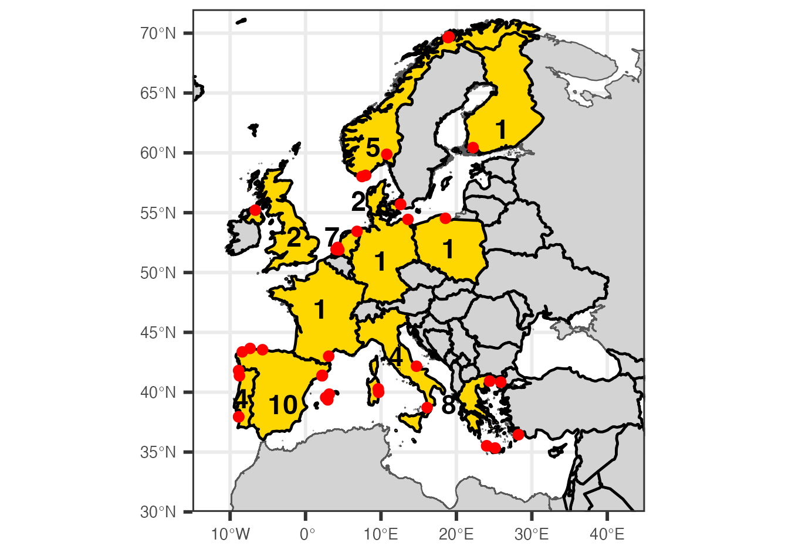
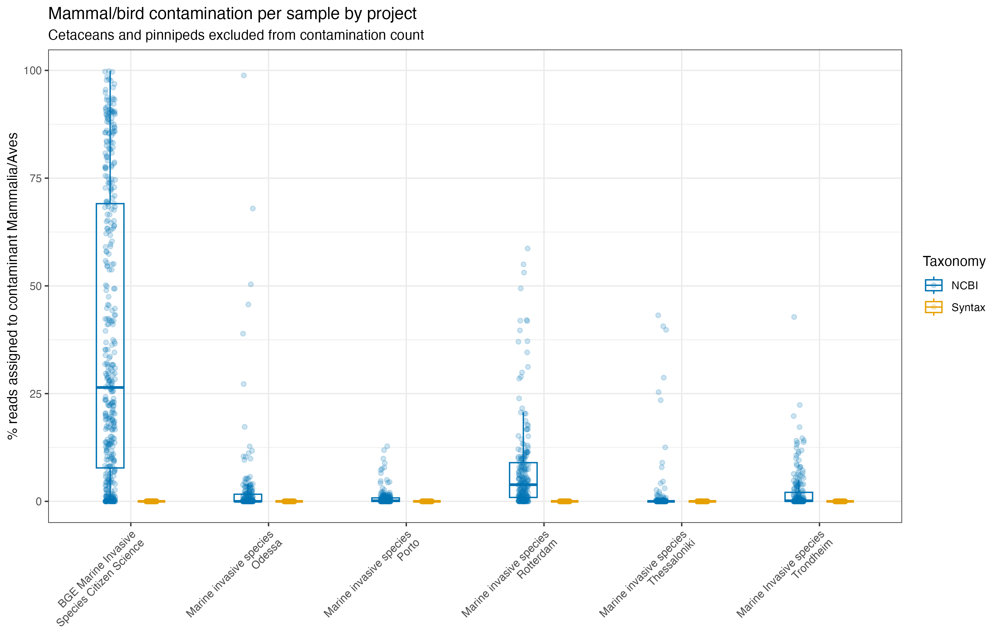
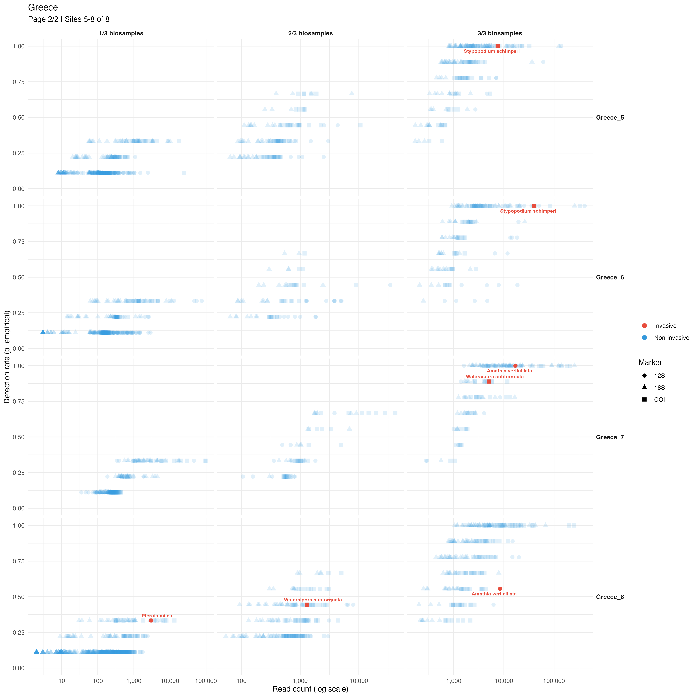

```{r setup, include=FALSE}
knitr::opts_chunk$set(
  echo = TRUE,
  warning = FALSE,
  message = FALSE,
  fig.align = "center",
  out.width = "100%"
)
```

# Introduction

**Project:** BGE Coastal Marine Invasive Species Citizen Science Project (BGE-MNIS)

**Scope:** At least 25 different teams of citizen scientists undertook 46 sampling events across 12 European countries (Fig. 1). The sampling events consisted of teams collecting 3 replicates of filtering approximately 1 litre of surface water from coastal harbour/port sites, through a 0.8 micron capsule filter.

[See the Instructional video to Citizen Scientists Here](https://www.youtube.com/watch?v=N9_K36hbp0Y).

These filters were sent to a central laboratory where DNA was extracted and environmental DNA characterized by PCR amplification using three commonly used eDNA metabarcoding markers (12S, 18S, COI). The 12S marker was designed to amplify vertebrate DNA, the 18S marker to broadly amplify eukaryote DNA and COI to amplify metazoan DNA. 

```{r, echo=FALSE, out.width="100%", fig.cap="**Figure 1.** BGE Coastal Marine Invasive Species Citizen Science Project sampling sites (red dots). Participating countries are inidcated by yellow and the number of distinct sampling events per country by the number within or adjacent to that country."}

```

The data we use in the example workflow below are operational taxonomic level (OTU) data where amplicon sequence variants (ASV) - which are unique denoised sequences from the raw sequence data - are further clustered by similarity to a predefined threshold.

---

# A warning on taxonomic annotation & database completeness

**Using curated databases - human/mammal DNA contamination as an example**

The BGE Marine Invasive Species (MIS) monitoring project consisted of two major programs. The first was this citizen science (CS) project and the second was a more dedicated port MIS monitoring project at five European ports, where sampling was: 1) More comprehensive and frequent than the CS sampling, 2) Using different equipment (a "vampire sampler" peristaltic pump rather than hand held syringe) and different water volumes and 3) was conducted by a dedicated local team of scientists.

Data from these two projects was generated in the same lab and sequenced at the same time, so the sequence datasets consist of all projects combined. Taxonomic annotation of these sequence datasets was performed using two different approaches: 1) Using dedicated, curated databases ([Mitofish for 12S](https://mitofish.aori.u-tokyo.ac.jp/), [Eukaryome for 18S](https://eukaryome.org/) & the [BOLD database for DNA barcoding](https://www.boldsystems.org/)), and also 2) Using the broader NCBI Eukaryote database. 

One of the shortcomings of using more refined curated databases *in isolation* is that taxonomic annotations can only be assigned based on the taxonomic scope/completeness of the database. This can become problematic when there are no good matches at lower taxonomic levels (species, genera families) for query DNA sequences in the reference database. As an example we can compare the taxonomic annotations of our 12S sequences using the Mitofish database Vs the NCBI dataset: 

```{r tax-anno-example-code, eval=FALSE}
# ── Load ──────────────────────────────────────────────────────────────────────
ps_syntax <- readRDS("Raw_data/12S_OTUs_syntax.RDS")
ps_ncbi   <- readRDS("Raw_data/12S_OTUs_NCBI.RDS")

# ── Subset ────────────────────────────────────────────────────────────────────
ps_syntax_cs <- subset_samples(ps_syntax, Sampling.area.Project == "BGE Marine Invasive Species Citizen Science")
ps_ncbi_cs   <- subset_samples(ps_ncbi,   Sampling.area.Project == "BGE Marine Invasive Species Citizen Science")
ps_syntax_cs <- prune_taxa(taxa_sums(ps_syntax_cs) > 0, ps_syntax_cs)
ps_ncbi_cs   <- prune_taxa(taxa_sums(ps_ncbi_cs)   > 0, ps_ncbi_cs)

ps_syntax_others <- subset_samples(ps_syntax,
                                   Sampling.area.Project != "BGE Marine Invasive Species Citizen Science" &
                                     Sampling.area.Project != "NA")
ps_ncbi_others   <- subset_samples(ps_ncbi,
                                   Sampling.area.Project != "BGE Marine Invasive Species Citizen Science" &
                                     Sampling.area.Project != "NA")
ps_syntax_others <- prune_taxa(taxa_sums(ps_syntax_others) > 0, ps_syntax_others)
ps_ncbi_others   <- prune_taxa(taxa_sums(ps_ncbi_others)   > 0, ps_ncbi_others)

# ── Helpers ───────────────────────────────────────────────────────────────────
is_contaminant <- function(tax) {
  # Mammalia/Aves but NOT cetacean or pinniped
  is_mb         <- !is.na(tax$Class)  & tax$Class  %in% c("Mammalia", "Aves")
  is_marine_mm  <- !is.na(tax$Family) & tax$Family %in% MARINE_MAMMAL_FAMILIES
  is_mb & !is_marine_mm
}

get_tax_reads <- function(ps) {
  tax     <- as.data.frame(tax_table(ps))
  otu_mat <- as(otu_table(ps), "matrix")
  if (!taxa_are_rows(ps)) otu_mat <- t(otu_mat)
  tax$total_reads <- rowSums(otu_mat)
  list(tax = tax, otu_mat = otu_mat)
}

# Marine mammals to RETAIN (not contamination)
CETACEAN_FAMILIES    <- c("Delphinidae", "Phocoenidae", "Balaenidae", "Balaenopteridae",
                          "Ziphiidae", "Physeteridae", "Kogiidae", "Monodontidae",
                          "Eschrichtiidae", "Platanistidae", "Iniidae", "Pontoporiidae")
PINNIPED_FAMILIES    <- c("Phocidae", "Otariidae", "Odobenidae")
MARINE_MAMMAL_FAMILIES <- c(CETACEAN_FAMILIES, PINNIPED_FAMILIES)

# ── compare_mambird ───────────────────────────────────────────────────────────
compare_mambird <- function(ps, label) {
  x   <- get_tax_reads(ps)
  tax <- x$tax
  tax[] <- lapply(tax, function(col) ifelse(is.na(col), "NA", col))
  
  total_otus  <- nrow(tax)
  total_reads <- sum(tax$total_reads)
  
  contam     <- tax %>% filter(is_contaminant(.))
  marine_mm  <- tax %>% filter(Class == "Mammalia",
                               Family %in% MARINE_MAMMAL_FAMILIES)
  
  shared_cols <- intersect(c("Class", "Order", "Family", "Genus", "Species", "total_reads"),
                           colnames(tax))
  
  cat("\n===", label, "===\n")
  cat("Total OTUs:                  ", total_otus, "\n")
  cat("Total reads:                 ", total_reads, "\n")
  cat("Contaminant OTUs:            ", nrow(contam),
      sprintf("(%.1f%%)", 100 * nrow(contam) / total_otus), "\n")
  cat("Contaminant reads:           ", sum(contam$total_reads),
      sprintf("(%.1f%%)\n", 100 * sum(contam$total_reads) / total_reads))
  cat("Cetacean/pinniped OTUs kept: ", nrow(marine_mm), "\n")
  
  cat("\nTop 10 contaminant OTUs by read count:\n")
  contam %>%
    arrange(desc(total_reads)) %>%
    select(all_of(shared_cols)) %>%
    head(10) %>%
    as.data.frame() %>%
    print()
  
  if (nrow(marine_mm) > 0) {
    cat("\nCetacean/pinniped OTUs retained:\n")
    marine_mm %>%
      arrange(desc(total_reads)) %>%
      select(all_of(shared_cols)) %>%
      as.data.frame() %>%
      print()
  }
  
  cat("\nClass breakdown of contaminant OTUs:\n")
  contam %>%
    count(Class, Order, sort = TRUE) %>%
    as.data.frame() %>%
    print()
  
  invisible(list(contaminants = contam, marine_mammals = marine_mm))
}

mb_syntax_cs     <- compare_mambird(ps_syntax_cs,     "CS           | Syntax")
mb_ncbi_cs       <- compare_mambird(ps_ncbi_cs,       "CS           | NCBI")
mb_syntax_others <- compare_mambird(ps_syntax_others, "Other (port) | Syntax")
mb_ncbi_others   <- compare_mambird(ps_ncbi_others,   "Other (port) | NCBI")

# ── Summary table ─────────────────────────────────────────────────────────────
summarise_mambird <- function(ps, label) {
  x   <- get_tax_reads(ps)
  tax <- x$tax
  tax[] <- lapply(tax, function(col) ifelse(is.na(col), "NA", col))
  
  contam <- tax %>% filter(is_contaminant(.))
  data.frame(
    Dataset        = label,
    Total_OTUs     = nrow(tax),
    Total_reads    = sum(tax$total_reads),
    Contam_OTUs    = nrow(contam),
    Contam_OTU_pct = round(100 * nrow(contam) / nrow(tax), 1),
    Contam_reads   = sum(contam$total_reads),
    Contam_read_pct = round(100 * sum(contam$total_reads) / sum(tax$total_reads), 1)
  )
}

comparison <- bind_rows(
  summarise_mambird(ps_syntax_cs,     "CS           | Syntax (no mam/bird classification)"),
  summarise_mambird(ps_ncbi_cs,       "CS           | NCBI"),
  summarise_mambird(ps_syntax_others, "Other (port) | Syntax (no mam/bird classification)"),
  summarise_mambird(ps_ncbi_others,   "Other (port) | NCBI")
)
cat("\n=== CS vs Other: Mammal/Bird Contamination (cetaceans/pinnipeds excluded) ===\n")
print(comparison, row.names = FALSE)

```
We can see that since the Mitofish dataset did not have representative Mammalia and Aves sequences, thus OTUs that were clearly from these groups were assigned to higher taxonomic level (Class etc) fish groups:

| Dataset | Total OTUs | Total reads | Contam OTUs | Contam OTUs (%) | Contam reads | Contam reads (%) |
|:--------|----------:|------------:|------------:|----------------:|-------------:|-----------------:|
| CS \| Syntax (no mam/bird classification)          | 1,631 | 24,737,371 |  0 | 0.0% |          0 |  0.0% |
| CS \| NCBI                                         | 1,631 | 24,737,371 | 67 | 4.1% | 11,350,014 | 45.9% |
| Other (port) \| Syntax (no mam/bird classification)| 1,923 | 66,095,640 |  0 | 0.0% |          0 |  0.0% |
| Other (port) \| NCBI                               | 1,923 | 66,095,640 | 98 | 5.1% |  1,180,296 |  1.8% |

**The table above shows the Mammal/bird contamination by dataset and taxonomy (cetaceans/pinnipeds excluded from contamination count).** The Syntax/Mitofish database assigns zero mammal/bird OTUs in both datasets as it lacks representative sequences for these groups. The NCBI database reveals substantial contamination/off target sequences present in the water, particularly in the CS dataset where 45.9% of reads are of mammalian/avian origin. Most of the mammal/bird sequences are human or human food (cows, pig, chicken etc).

We can also see that there was a clear difference in the amount of mammal/bird contamination between the CS project and the dedicated port MIS monitoring project in mammal/bird DNA prevalence in the datasets. The CS project sampling methods were probably more prone to external/airborne etc DNA contamination than the port MIS monitoring project methods using the vampire pump. Other factors may also be important, for example,there may have been some site selection bias in the CS project where sampling sites were more likely to have human/anthropogenic DNA contamination. However, given the clear differences in the amount of human/anthropogenic DNA content and the similarities overall in sites (i.e. ports & boat harbours etc) between the two projects, it would seem the sampling methods differences are probably driving these differences. 
```{r anthropogeniDNAplot, eval=FALSE}
sample_mambird_pct <- function(ps, taxonomy) {
  x       <- get_tax_reads(ps)
  tax     <- x$tax
  otu_mat <- x$otu_mat
  tax[]   <- lapply(tax, function(col) ifelse(is.na(col), "NA", col))
  
  contam_otus   <- rownames(tax)[is_contaminant(tax)]
  sample_totals <- colSums(otu_mat)
  contam_reads  <- if (length(contam_otus) > 0) {
    colSums(otu_mat[contam_otus, , drop = FALSE])
  } else {
    rep(0, ncol(otu_mat))
  }
  
  data.frame(
    Sample   = colnames(otu_mat),
    Project  = as.character(sample_data(ps)$Sampling.area.Project),
    Taxonomy = taxonomy,
    MB_pct   = 100 * contam_reads / sample_totals
  )
}

plot_df <- bind_rows(
  sample_mambird_pct(ps_syntax_cs,     "Syntax"),
  sample_mambird_pct(ps_ncbi_cs,       "NCBI"),
  sample_mambird_pct(ps_syntax_others, "Syntax"),
  sample_mambird_pct(ps_ncbi_others,   "NCBI")
)

p1 <- ggplot(plot_df, aes(x = Project, y = MB_pct, colour = Taxonomy)) +
  geom_boxplot(outlier.shape = NA, width = 0.4,
               position = position_dodge(width = 0.6), alpha = 0.3) +
  geom_jitter(position = position_jitterdodge(jitter.width = 0.15, dodge.width = 0.6),
              size = 1.5, alpha = 0.2) +
  scale_colour_manual(values = c("Syntax" = "#E69F00", "NCBI" = "#0072B2")) +
  scale_x_discrete(labels = function(x) stringr::str_wrap(x, width = 25)) +
  labs(
    title   = "Mammal/bird contamination per sample by project",
    subtitle = "Cetaceans and pinnipeds excluded from contamination count",
    x       = NULL,
    y       = "% reads assigned to contaminant Mammalia/Aves",
    colour  = "Taxonomy"
  ) +
  theme_bw() +
  theme(axis.text.x = element_text(angle = 45, hjust = 1))

```

```{r, echo=FALSE, out.width="100%", fig2_cap="**Figure 2.** BGE Coastal Marine Invasive Species projects (X-axis), proportion of reads per individual PCR assigned to Mammal/Aves. Boxes show the median (middle line) and interquartile range (box) of mammal/bird read contamination across samples within each project. There is clearly a large difference between the different taxonomic assignment methods (legend), and also between the BGE MIS Citizen Science samples and all the dedicated port monitoring sites (Odessa, Porto, Rotterdam, Thessaloniki, Trondheim)"}

```

Data shown throughout the rest of the pipeline below are thus using the NCBI taxonomic annotations.

## Pipeline Overview

The full analysis pipeline consists of three scripts executed in sequence, supported by modular function files:

1. **`00_Invasive_Status_GSID-NCBI.R`** — Loads raw phyloseq objects, cleans metadata, extracts species-by-country combinations, and queries invasive species databases (GISD, EASIN) to produce initial invasive species flags.
2. **`01_Database_query_WORMS.R`** — Cross-references flagged species against WoRMS and GBIF to produce verified invasive status classifications (INVASIVE / INTRODUCED / NATIVE / UNKNOWN).
3. **`02_CS_detection_analysis.R`** — Filters the phyloseq objects (mammal/bird removal, non-marine taxa removal, low-read PCR filtering), creates COLLAPSED versions for detection analysis, runs hierarchical detection analysis, merges detection probabilities with both invasive status streams, classifies detection reliability, and produces all summary tables and figures.
4. **`02b_GBIF_MIS_novel_check.R`** — Takes confirmed MIS detections from Script 02, expands them to one row per species × site, and queries GBIF via rgbif to find the nearest georeferenced occurrence record for each combination. Calculates Haversine distances to classify each detection as well-documented, known nearby, a range edge, a possible range expansion, or potentially novel (>500 km from any GBIF record). Appends per-PCR read statistics (total reads, mean/min/max reads and proportional abundance across all PCRs including zeros) and joins detection reliability tiers from combined_all. Outputs a full validation table for all MIS detections and a formatted table restricted to detections probably of the most interest - those ≥100 km from the nearest GBIF record.

Function files sourced by these scripts:

| Function file | Sourced by | Functions provided |
|---|---|---|
| `FUNC_process_metadata.R` | Script 00 | `process_metadata()` |
| `FUNC_process_invasives.R` | Script 00 | `process_invasives()`, `extract_species_by_country()` |
| `FUNC_query_invasive_status_databases.R` | Script 01 | `process_species_list()`, `query_species_status()`, `determine_final_status()` |
| `FUNC_occupancy_power_analysis.R` | Script 02 | `run_detection_analysis()`, `combine_detection_invasive()`, `combine_markers()`, `plot_site_by_marker()` |
| `FUNC_plot_site_facet_theta.R` | Script 02 | `plot_country_facet_theta()` |
| `FUNC_worms_lifestyle.R` | Script 02 | `query_worms_functional_groups()`, `classify_worms_lifestyle()`, `add_lifestyle_from_worms()` |
| `FUNC_assign_lifestyle.R` | Script 02 | `assign_lifestyle()`, `check_unmatched_lifestyle()`, `default_lifestyle_lookup()` |
| `FUNC_combine_lifestyle.R` | Script 02 | `combine_lifestyle()`, `map_worms_to_lifestyle()` |
| `wheel_of_life_R.R` | Script 02 | `generate_wheels()` |

**Detailed function reference:**

<details>
<summary><b>FUNC_process_metadata.R</b></summary>

**`process_metadata(marker, ps_input)`**

- **`marker`** — marker label (e.g. `"12S"`)
- **`ps_input`** — raw phyloseq object from RDS
- *Returns:* list with `$phyloseq` — cleaned phyloseq with standardised metadata columns and validated Country → Site → Biosample → PCR hierarchy.

</details>

<details>
<summary><b>FUNC_process_invasives.R</b></summary>

**`process_invasives(marker, ps, country_col)`**

- **`marker`** — marker label
- **`ps`** — cleaned phyloseq from `process_metadata()`
- **`country_col`** — name of the sample_data column containing country information
- *Returns:* list with `$invasive_status` — long-format species × country × GISD/EASIN flag data frame.

**`extract_species_by_country(ps, country_col)`**

- **`ps`** — phyloseq object
- **`country_col`** — country column name
- *Returns:* data frame of all unique species × country combinations detected in the data (presence/absence per country).

</details>

<details>
<summary><b>FUNC_query_invasive_status_databases.R</b></summary>

**`process_species_list(invasive_status, output_file)`**

- **`invasive_status`** — data frame from `process_invasives()`
- **`output_file`** — CSV path for checkpoint saves (every 50 rows)
- *Returns:* data frame with one row per species × country, columns: `AphiaID`, `WoRMS_Status`, `GBIF_EstablishmentMeans`, `Final_Status`. Requires internet access; runtime ~30–60 min per marker.

**`query_species_status(species, country, ...)`**

- **`species`** — species name string
- **`country`** — country name string
- *Returns:* single-row tibble with WoRMS and GBIF status fields for that species × country combination.

**`determine_final_status(worms_status, gbif_status)`**

- **`worms_status`**, **`gbif_status`** — parsed status strings
- *Returns:* `Final_Status` string applying priority hierarchy: INVASIVE > INTRODUCED > NATIVE > NO_DATA > UNKNOWN.

</details>

<details>
<summary><b>FUNC_occupancy_power_analysis.R</b></summary>

**`run_detection_analysis(ps, marker, site_var)`**

- **`ps`** — COLLAPSED phyloseq object
- **`marker`** — marker label
- **`site_var`** — sample_data column name identifying sites (e.g. `"Sampling.event.ID"`)
- *Returns:* list with `$site_detections` (θ, p, reliability, taxonomy per OTU × site), `$empirical_3x3`, `$design_performance`. Also saves four CSVs to `Processed_data/`.

**`combine_detection_invasive(detection_results, invasive_status, verified_status)`**

- **`detection_results`** — output of `run_detection_analysis()`
- **`invasive_status`** — `$invasive_status` from `process_invasives()`
- **`verified_status`** — output of `process_species_list()`
- *Returns:* list with `$site_level`, `$otu_summary`, `$invasive_detections`, `$reliable_invasive`, `$unreliable_invasive`.

**`combine_markers(...)`**

- Named arguments — one `combine_detection_invasive()` output per marker (e.g. `` `12S` = combined_12S ``)
- *Returns:* combined list with `$site_level` and `$otu_summary` across all markers, with `Marker` column added.

**`plot_site_by_marker(combined_all, site, x_metric, y_metric)`**

- **`combined_all`** — combined markers object
- **`site`** — site ID string (e.g. `"France_1"`)
- **`x_metric`**, **`y_metric`** — column names to plot (e.g. `"total_reads"`, `"p_empirical"`)
- *Returns:* ggplot scatter of detection metrics for a single site, marker indicated by point shape.

</details>

<details>
<summary><b>FUNC_plot_site_facet_theta.R</b></summary>

**`plot_country_facet_theta(combined_all, country, output_dir)`**

- **`combined_all`** — combined markers object
- **`country`** — country name string (e.g. `"Greece"`)
- **`output_dir`** — path for PNG output
- *Returns:* faceted plots of read count vs detection rate for all sites in a country, one panel per site per marker. Saves PNG to `output_dir`.

</details>

<details>
<summary><b>FUNC_worms_lifestyle.R</b></summary>

**`query_worms_functional_groups(species_list, cache_file, delay)`**

- **`species_list`** — character vector of species names
- **`cache_file`** — CSV path for caching results
- **`delay`** — seconds between API requests (default 0.3)
- *Returns:* data frame with `functional_group` column per species. Loads from cache if available; only queries new species.

**`classify_worms_lifestyle(worms_traits, custom_mapping)`**

- **`worms_traits`** — output of `query_worms_functional_groups()`
- **`custom_mapping`** — optional named vector overriding default mappings
- *Returns:* data frame with `lifestyle_worms` column mapping WoRMS functional group strings to standardised categories (Fish, Zooplankton, Phytoplankton, etc.).

**`add_lifestyle_from_worms(site_level, worms_traits)`**

- **`site_level`** — `combined_all$site_level`
- **`worms_traits`** — cached traits data frame
- *Returns:* updated site_level with WoRMS-derived lifestyle joined by species name.

</details>

<details>
<summary><b>FUNC_assign_lifestyle.R</b></summary>

**`default_lifestyle_lookup()`**

- No arguments
- *Returns:* the default Order/Class → lifestyle category mapping table. View or edit this to customise assignments before passing to `assign_lifestyle()`.

**`assign_lifestyle(site_level, lookup)`**

- **`site_level`** — `combined_all$site_level`
- **`lookup`** — optional custom lookup table (defaults to `default_lifestyle_lookup()`)
- *Returns:* updated site_level with `lifestyle` column added. Prints coverage summary by category.

**`check_unmatched_lifestyle(site_level)`**

- **`site_level`** — `combined_all$site_level` (after `assign_lifestyle()`)
- *Action:* prints grouped table of taxa assigned "Other" or "Unclassified" by Phylum/Class/Order, to guide manual corrections.

</details>

<details>
<summary><b>FUNC_combine_lifestyle.R</b></summary>

**`map_worms_to_lifestyle(fg_string)`**

- **`fg_string`** — WoRMS `functional_group` string (e.g. `"plankton > zooplankton"`)
- *Returns:* standardised lifestyle category string. Used internally by `combine_lifestyle()`.

**`combine_lifestyle(site_level, worms_traits, prefer)`**

- **`site_level`** — with `lifestyle` column from `assign_lifestyle()`
- **`worms_traits`** — cached WoRMS traits data frame
- **`prefer`** — `"manual"` (default) or `"worms"` — which assignment wins on disagreement
- *Returns:* list with `$site_level` (with `lifestyle_final` column) and `$disagreements` (data frame of species where manual and WoRMS assignments differ).

</details>

<details>
<summary><b>wheel_of_life_R.R</b></summary>

**`generate_wheels(...)`**

- Named phyloseq arguments — one per marker (e.g. `` `Vertebrates 12S` = ps_12s ``)
- **`output_dir`** — directory for PDF outputs
- **`prefix`** — filename prefix
- **`site_var`** — sample_data column identifying sites
- **`collector_var`**, **`location_var`**, **`date_var`** — sample_data columns for metadata box
- **`metadata_from`** — which marker's sample_data to use for metadata (must match a marker name)
- **`include_genus`** — logical; include genus-level identifications (default `TRUE`)
- **`min_group_size`** — integer; groups with fewer taxa collapsed to "OTHERS" wedge (default 3)
- **`center_image`** — path to image file for wheel hub (optional)
- **`center_image_zoom`** — scaling factor for hub image (default 0.04)
- **`script_dir`** — directory containing `mm_wheel_of_life.py`
- **`python_path`** — path to Python 3 executable
- *Action:* exports per-site taxonomy CSVs, then calls `mm_wheel_of_life.py` to generate one wheel-of-life PDF per sampling event in `output_dir`.

</details>

**Wheel of Life visualizations** (`wheel_of_life_R.R`, `generate_wheels()`): An R wrapper around a Python plotting script (`mm_wheel_of_life.py`) that produces a circular phylogenetic diagram per site. Each wheel displays all species and genera detected across all markers at a single sampling event, with taxa arranged in radial wedges by major life group (with colour coding). Symbols following each taxon name show the marker(s) the taxon was detected with, and groups with fewer than `min_group_size` taxa are collapsed into an "OTHERS" wedge. A subtitle shows total OTU count summaries. A metadata box (bottom left) shows site name, collector, and date; a legend (top right) keys life group colours; and an optional centre image can be placed at the hub. The function iterates over all sites present, saving one PDF per site to `output_dir`. The function can combine multiple marker datasets.Requires Python 3 with the `matplotlib`, `numpy`, and `pandas` packages.

### Data Flow

The pipeline has two independent data preparation streams that converge in Script 02:

<div style="font-family: monospace; font-size: 0.85em; line-height: 1.5;">

```{=html}
<style>
.flow-wrap { display: flex; justify-content: center; margin: 1.5em 0; }
.flow { display: flex; flex-direction: column; align-items: center; gap: 0; min-width: 820px; }
.flow-row { display: flex; align-items: flex-start; justify-content: center; gap: 0; width: 100%; }
.flow-box {
  background: #f0f4f8; border: 1.5px solid #4a6fa5; border-radius: 6px;
  padding: 8px 14px; text-align: center; font-size: 0.82em; line-height: 1.4;
  white-space: nowrap;
}
.flow-box.input  { background: #dceefb; border-color: #2b78e4; font-weight: bold; }
.flow-box.script { background: #e8f5e9; border-color: #388e3c; font-weight: bold; }
.flow-box.data   { background: #fff3e0; border-color: #f57c00; }
.flow-box.output { background: #f3e5f5; border-color: #7b1fa2; font-weight: bold; }
.flow-arrow { display: flex; flex-direction: column; align-items: center; color: #555; font-size: 1.1em; line-height: 1; padding: 2px 0; }
.flow-arrow-h { display: flex; align-items: center; color: #555; font-size: 1.1em; padding: 0 4px; margin-top: 14px; }
.flow-split { display: flex; align-items: flex-start; gap: 24px; }
.flow-col { display: flex; flex-direction: column; align-items: center; gap: 0; }
.flow-label { font-size: 0.75em; color: #666; font-style: italic; margin: 0 2px; }
</style>

<div class="flow-wrap"><div class="flow">

  <!-- RAW INPUT -->
  <div class="flow-box input">RAW PHYLOSEQ OBJECTS (12S, 18S, COI)</div>
  <div class="flow-arrow">↓</div>

  <!-- SCRIPT 00 row: two parallel streams start here -->
  <div class="flow-row">
    <div class="flow-col">
      <div class="flow-box script">SCRIPT 00<br><span style="font-weight:normal">process_metadata()</span></div>
      <div class="flow-arrow">↓</div>
      <div class="flow-box data">Cleaned metadata<br><code>meta_*$phyloseq</code></div>
    </div>
    <div class="flow-arrow-h" style="margin-top:0; padding: 0 30px; font-size:1.8em; color:#aaa;">⋮</div>
    <div class="flow-col">
      <div class="flow-box script">SCRIPT 00<br><span style="font-weight:normal">process_invasives()</span></div>
      <div class="flow-arrow">↓</div>
      <div class="flow-box data">Species × country pairs<br>GISD + EASIN queries</div>
      <div class="flow-arrow">↓</div>
      <div class="flow-split">
        <div class="flow-col">
          <div class="flow-box data"><code>inv_*$invasive_status</code><br><span class="flow-label">EASIN/GISD flags</span></div>
        </div>
        <div class="flow-arrow-h">→</div>
        <div class="flow-col">
          <div class="flow-box script">SCRIPT 01<br><span style="font-weight:normal">process_species_list()</span></div>
          <div class="flow-arrow">↓</div>
          <div class="flow-box data"><code>verified_*</code><br><span class="flow-label">WoRMS + GBIF verified<br>Final_Status: INVASIVE /<br>INTRODUCED / NATIVE / UNKNOWN</span></div>
        </div>
      </div>
    </div>
  </div>

  <div class="flow-arrow" style="margin-top:8px;">↓</div>

  <!-- SCRIPT 02 Steps 1-5 -->
  <div class="flow-row">
    <div class="flow-col">
      <div class="flow-box script">SCRIPT 02 — Steps 1–5<br>
        <span style="font-weight:normal; font-size:0.9em">Mammal/bird removal · WoRMS env filter<br>Low-read PCR filter · OTU collapsing</span>
      </div>
      <div class="flow-arrow">↓</div>
      <div class="flow-split">
        <div class="flow-col">
          <div class="flow-box data">ORIGINAL phyloseq<br><span class="flow-label">OTU counts, Table 1,<br>diversity analyses</span></div>
        </div>
        <div class="flow-arrow-h">+</div>
        <div class="flow-col">
          <div class="flow-box data">COLLAPSED phyloseq<br><span class="flow-label">Detection analysis<br>θ, p, site presence</span></div>
        </div>
      </div>
    </div>
  </div>

  <div class="flow-arrow" style="margin-top:8px;">↓ <span style="font-size:0.8em; color:#888"> ← inv_* + verified_* converge here</span></div>

  <!-- SCRIPT 02 Steps 6-14 -->
  <div class="flow-box script" style="min-width:420px;">SCRIPT 02 — Steps 6–14<br>
    <span style="font-weight:normal; font-size:0.9em">
      run_detection_analysis() on COLLAPSED ps<br>
      combine_detection_invasive() — merges θ/p with inv_* and verified_*<br>
      combine_markers() — 12S + 18S + COI<br>
      Manual corrections (native species un-flagged)
    </span>
  </div>

  <div class="flow-arrow">↓</div>

  <!-- OUTPUT -->
  <div class="flow-box output" style="min-width:420px;">
    SUMMARY TABLES &amp; FIGURES<br>
    <span style="font-weight:normal; font-size:0.9em">Steps 7–14 use ORIGINAL for OTU counts · COLLAPSED for detection metrics</span>
  </div>

</div></div>
```

</div>

**Key design principle:** Steps 1–5 of Script 02 operate exclusively on phyloseq objects and have no interaction with invasive status data. Scripts 00/01 operate exclusively on species lists and database queries. These two streams are independent until they converge in Script 02's `combine_detection_invasive()` function, which merges detection probabilities from the phyloseq analysis with invasive flags from both database query streams to produce the unified `is_invasive` classification.

---

# Data Preparation & Invasive Species Status

**Scripts:** `00_Invasive_Status_GSID-NCBI.R`, `01_Database_query_WORMS.R`
**Function files:** `FUNC_process_metadata.R`, `FUNC_process_invasives.R`, `FUNC_query_invasive_status_databases.R`

```{r script-01-calls, eval=FALSE}
### Data summairies with gathered GSID/EASIN status 

source("Scripts/Functions/FUNC_process_metadata.R")
source("Scripts/Functions/FUNC_process_invasives.R")

bge12s_cs <- readRDS("/Users/glenndunshea/Documents/GitHub/BGE_Dedicated_MNIS_seasonal/Raw_data/12S_OTUs_NCBI.RDS")
bge18S_cs <- readRDS("/Users/glenndunshea/Documents/GitHub/BGE_Dedicated_MNIS_seasonal/Raw_data/18S_OTUs_NCBI.RDS")
bgeCOI_cs <- readRDS("/Users/glenndunshea/Documents/GitHub/BGE_Dedicated_MNIS_seasonal/Raw_data/COI_OTUs_NCBI.RDS")

# Steps 1–2 only
meta_12S <- process_metadata("12S", ps_input = bge12s_cs)
meta_18S <- process_metadata("18S", ps_input = bge18S_cs)
meta_COI <- process_metadata("COI", ps_input = bgeCOI_cs)

# Steps 3–4 (only when ready)
inv_12S <- process_invasives("12S", meta_12S$phyloseq, country_col = "Sampling.area.Country")
inv_18S <- process_invasives("18S", meta_18S$phyloseq, country_col = "Sampling.area.Country")
inv_COI <- process_invasives("COI", meta_COI$phyloseq, country_col = "Sampling.area.Country")
```

---

## Metadata Processing

Loads raw phyloseq objects (one per marker: 12S, 18S, COI) from RDS files. Each contains an OTU table, taxonomy table, and sample metadata produced by the upstream bioinformatics pipeline (DADA2 + taxonomic assignment via NCBI or SINTAX). The `process_metadata()` function cleans and standardises the sample metadata, adding site identifiers (`Sampling.event.ID`), biosample names (`Name`), PCR replicate labels (`Replicate`), country (`Location`), and project assignment. It subsets to the BGE Marine Invasive Species Citizen Science project and validates that the hierarchical sampling structure (Country → Site → Biosample → PCR replicate) is intact. 

**Note** that this function is custom and specific to the shortcomings of our BGE metadata - it is not intended for use with other datasets, but may be use as a template if there are specific, consistent structural defects to other datasets.

---

## Species Extraction and Database Queries

The `process_invasives()` function takes a cleaned phyloseq object (output of `process_metadata()`) and runs two steps per marker.

**Note** that this function is generic and can be used with any phyloseq object - simply use the function "country_col =" argument to designate the appropriate column that contains "Country" information in your phyloseq objects' metadata.

### Step 3: Species-by-Country Extraction

The function `extract_species_by_country()` converts the OTU table to presence/absence, then for each country (the `Location` column in the BGE sample metadata), identifies which species-level OTUs were detected in at least one sample. It produces a long-format data frame of all unique species × country combinations across the dataset, excluding OTUs without species-level taxonomic assignment. This is the master species list that feeds into all downstream invasive status queries.

### Step 4: GISD and EASIN Database Queries

Each unique species is queried against two invasive species databases:

**GISD (Global Invasive Species Database):** The function `gisd_query_single()` sends an HTTP request to the IUCN GISD web interface for each species name. It parses the returned HTML to determine whether the species page contains the text "Invasive Species" (→ flagged as `"Invasive"`), whether the species is listed but not explicitly labelled invasive (→ `"Listed"`), or whether the species is not found (→ `NA`). Queries are rate-limited (1 second delay) and results are cached to `Processed_data/gisd_cache.rds` so that re-running the pipeline does not repeat API calls. The function `query_gisd_batch()` manages the batch, skipping any species already present in the cache.

**EASIN (European Alien Species Information Network):** The function `query_easin_all()` queries the EASIN REST API for each country represented in the dataset. For each country ISO code, it fetches two lists from the JRC endpoint: the "concerned member state" list and the "established member state" list (both capped at 500 species per request). These are combined into a per-country species inventory of known alien species. Results are cached to `Processed_data/easin_cache.rds`. The function `check_easin_status()` then checks whether each detected species appears on the EASIN list for the country where it was detected.

**Flagging logic:** Each species × country record is assigned one of three flags based on the combined database results:

- `"Invasive_in_country"` — species appears on the EASIN list for that specific country (country-level evidence of alien/invasive status).
- `"GISD_listed_globally"` — species is listed on GISD (global-level evidence) but not on the EASIN list for the specific country.
- `"Not_flagged"` — no evidence of invasive status from either database.

**Outputs:** Two CSV files per marker are saved to `Processed_data/`:

- `species_invasive_status_{marker}.csv` — full species × country × flag table (all species).
- `species_manual_review_{marker}.csv` — all flagged species × country combinations (i.e. any record where `invasive_flag != "Not_flagged"`), retaining the `Location` column alongside `GISD_status`, `EASIN_status`, and `invasive_flag`. This is the file intended for manual expert review: because invasive status is inherently country-specific (a species native in Norway may be invasive in Spain), the country context is essential for a reviewer to make any meaningful judgement. The downstream WoRMS/GBIF verification (`process_species_list()` in Script 01) also operates on species × country pairs drawn from the full `invasive_status` object, not from this file.

The function returns a list containing the marker name, the species × country data frame, and the flagged invasive status data frame (`invasive_status`). This `invasive_status` object is the input to the next stage.

---

## Multi-Database Verification (WoRMS, GBIF)

```{r script-01-worms-calls, eval=FALSE}
# Load the database query script...
source("Scripts/Functions/FUNC_query_invasive_status_databases.R")

# Process each marker's species list through WoRMS/GBIF
# (This takes 30-60 min per marker due to API rate limits)

verified_12S <- process_species_list(
  inv_12S$invasive_status, 
  output_file = "invasive_verified_12S.csv"
)

verified_18S <- process_species_list(
  inv_18S$invasive_status, 
  output_file = "invasive_verified_18S.csv"
)

verified_COI <- process_species_list(
  inv_COI$invasive_status, 
  output_file = "invasive_verified_COI.csv"
)


save.image(file = "post_01.Database_query_WORMS.RData")
```

This script takes the flagged species lists produced by `process_invasives()` and cross-references every species × country combination against two additional authoritative databases — WoRMS and GBIF — to produce a verified invasive status classification. **This function WILL NOT WORK without running process_invasives() first.** It must be run locally (but not in restricted compute environments) because it requires sustained internet access to query external REST APIs. Expected runtime is 30–60 minutes per marker for ~1,000 species × country combinations, due to API rate limits.

### Database Queries

For each species × country combination, the function `query_species_status()` executes the following queries in sequence:

**WoRMS (World Register of Marine Species):**

1. **AphiaID lookup** — the species name is resolved to a WoRMS AphiaID using the `worrms` R package (`wm_name2id()`). If the exact match fails, a fuzzy match is attempted (`wm_records_name()` with `fuzzy = TRUE`). If the package call fails entirely, a fallback direct REST API call to `https://www.marinespecies.org/rest/AphiaIDByName/` is used. AphiaIDs are cached in an in-memory environment to avoid redundant lookups when the same species appears in multiple countries.

2. **Common name retrieval** — the English vernacular name is fetched via `wm_common_id()`.

3. **Distribution records** — `wm_distribution()` returns all known distribution records for the species, including locality, origin (native/introduced/alien), invasiveness flags, and occurrence status. The function `parse_worms_status()` filters these records for the target country using regex patterns that match both the country name and associated marine regions (e.g., "Norway" matches "Norway|Norwegian|North Sea|Barents|Skagerrak"). If no country-specific records exist, it falls back to broader European/regional matches ("Europe|Atlantic|Mediterranean|Baltic|North Sea"). The distribution data includes WRiMS (World Register of Introduced Marine Species) records, which are integrated into WoRMS as of 2024-08-22 and include explicit `invasiveness` and `occurrence` fields.

**GBIF (Global Biodiversity Information Facility):**

1. **Taxon key resolution** — the species name is matched to a GBIF backbone taxonomy key via `name_backbone()`.

2. **Establishment means** — `occ_data()` retrieves up to 100 occurrence records for the species in the target country (using ISO country code), extracting the `establishmentMeans` field where populated. This field can contain values such as "Native", "Introduced", "Invasive", or "Managed".

**OBIS (Ocean Biodiversity Information System):** Optionally available (disabled by default via `USE_OBIS <- FALSE`). When enabled, it queries `robis::occurrence()` for additional marine occurrence records, filtered by country. Adds an `OBIS_Records` count to the output. The reason that the default here is not to search OBIS is that "get_obis_records()" queries OBIS by species name and then tries to filter by country via a country column in the returned records — but that column may not always be populated in OBIS occurrence data, meaning country-level filtering can be unreliable or silently fall through. For this reason, the function returns a record count (OBIS_Records) but doesn't actually feed OBIS into the Final_Status determination — that logic only uses WoRMS and GBIF. So the function can be edited for enabling OBIS - this adds the count as metadata but won't change any is_invasive classifications downstream.

All queries are rate-limited: 0.5 seconds between WoRMS requests, 0.3 seconds between GBIF requests, 0.3 seconds between OBIS requests.

### Final Status Determination

The function `determine_final_status()` synthesises results from all databases into a single classification per species × country combination, using the following priority hierarchy:

1. **INVASIVE** — WoRMS status is `"INVASIVE"` (origin or invasiveness fields contain "invasive"), OR GBIF establishment means contains "Invasive".
2. **INTRODUCED** — WoRMS status is `"INTRODUCED"` (origin contains "introduced", "alien", "non-native", or "exotic"), OR GBIF establishment means contains "Introduced".
3. **NATIVE** — WoRMS status is `"NATIVE"`, OR GBIF establishment means contains "Native".
4. **NO_DATA** — WoRMS returned distribution records for the region but none with informative origin/invasiveness fields.
5. **UNKNOWN** — neither WoRMS nor GBIF returned any relevant data.

### Output

The `process_species_list()` function processes all unique species × country combinations with a progress bar and saves checkpoints every 50 rows (in case of interruption). The final output CSV contains one row per species × country combination with the following columns:

- `Species`, `Country`, `AphiaID`, `CommonName`
- `WoRMS_Status`, `WoRMS_Origin`, `WoRMS_Invasive`, `WoRMS_Occurrence`
- `GBIF_EstablishmentMeans`
- `OBIS_Records` (if OBIS enabled)
- `Data_Sources` (which databases returned data, e.g. "WoRMS; GBIF")
- `Final_Status` (one of: INVASIVE, INTRODUCED, NATIVE, NO_DATA, UNKNOWN)

These verified status files feed into Script 02 (`combine_detection_invasive()`), where they are joined with detection probabilities and EASIN/GISD flags to produce the final `is_invasive` classification per species × site.

---

# Data Artefact Filtering and Collation

**Script:** `02_CS_detection_analysis.R` (Steps 1–5)
**Function files:** None (helper functions defined inline)
**Input:** `meta_12S`, `meta_18S`, `meta_COI` from Script 00

This script operates exclusively on the phyloseq objects in its first five steps. It subsets to citizen science samples, removes non-target taxa (mammals/birds, non-marine species), filters low-quality PCR replicates, and creates both ORIGINAL and COLLAPSED phyloseq versions. It has no interaction with the invasive status data — that merge happens in Steps 6 onward of the same script.

Two parallel phyloseq versions are maintained from this point forward:

- **ORIGINAL** — retains all OTUs per species; used for OTU-level summary statistics (Table 1, read counts, diversity).
- **COLLAPSED** — multi-OTU species are collapsed by summing reads; used for detection probability estimation (θ, *p*, site-level presence).

---

## Step 1: Subset to Citizen Science Samples

```{r step1-code, eval=FALSE}

ps_cs_12S <- subset_samples(meta_12S$phyloseq, 
                            Sampling.area.Project == "BGE Marine Invasive Species Citizen Science")
ps_cs_18S <- subset_samples(meta_18S$phyloseq, 
                            Sampling.area.Project == "BGE Marine Invasive Species Citizen Science")
ps_cs_COI <- subset_samples(meta_COI$phyloseq, 
                            Sampling.area.Project == "BGE Marine Invasive Species Citizen Science")

# Store pre-filtering totals
pre_filter_seqs <- c(sum(sample_sums(ps_cs_12S)), sum(sample_sums(ps_cs_18S)), sum(sample_sums(ps_cs_COI)))
pre_filter_otus <- c(sum(taxa_sums(ps_cs_12S) > 0), sum(taxa_sums(ps_cs_18S) > 0), sum(taxa_sums(ps_cs_COI) > 0))
```


---

## Step 2: Remove Mammal and Bird OTUs

```{r step2-code, eval=FALSE}

CETACEAN_FAMILIES <- c("Delphinidae", "Phocoenidae", "Balaenidae", "Balaenopteridae",
                       "Ziphiidae", "Physeteridae", "Kogiidae", "Monodontidae",
                       "Eschrichtiidae", "Platanistidae", "Iniidae", "Pontoporiidae")
PINNIPED_FAMILIES <- c("Phocidae", "Otariidae", "Odobenidae")
MARINE_MAMMAL_FAMILIES <- c(CETACEAN_FAMILIES, PINNIPED_FAMILIES)

filter_mambird_ps <- function(ps, marker) {
  tax <- as.data.frame(tax_table(ps))
  
  is_mammal_or_bird <- !is.na(tax$Class) & tax$Class %in% c("Mammalia", "Aves")
  is_marine_mammal  <- !is.na(tax$Family) & tax$Family %in% MARINE_MAMMAL_FAMILIES
  
  keep <- rownames(tax)[!is_mammal_or_bird | is_marine_mammal]
  
  seqs_before <- sum(sample_sums(ps))
  ps_filt <- prune_taxa(keep, ps)
  ps_filt <- prune_taxa(taxa_sums(ps_filt) > 0, ps_filt)
  seqs_after <- sum(sample_sums(ps_filt))
  
  n_kept_mm <- sum(is_mammal_or_bird & is_marine_mammal)
  
  cat(marker, ": removed", ntaxa(ps) - ntaxa(ps_filt), "mammal/bird OTUs (",
      ntaxa(ps), "->", ntaxa(ps_filt), ") |",
      formatC(seqs_before - seqs_after, format = "d", big.mark = ","), "seqs removed (",
      formatC(seqs_before, format = "d", big.mark = ","), "->",
      formatC(seqs_after, format = "d", big.mark = ","), ") |",
      n_kept_mm, "cetacean/pinniped OTUs retained\n")
  ps_filt
}

ps_cs_12S <- filter_mambird_ps(ps_cs_12S, "12S")
ps_cs_18S <- filter_mambird_ps(ps_cs_18S, "18S")
ps_cs_COI <- filter_mambird_ps(ps_cs_COI, "COI")
```


1. **Data:** OTU taxonomy tables from each marker's phyloseq object.
2. **Method:** OTUs assigned to Class `Mammalia` or `Aves` are removed, **except** cetaceans (families: Delphinidae, Phocoenidae, Balaenidae, Balaenopteridae, Ziphiidae, Physeteridae, Kogiidae, Monodontidae, Eschrichtiidae, Platanistidae, Iniidae, Pontoporiidae) and pinnipeds (Phocidae, Otariidae, Odobenidae), which are retained as legitimate targets for marine biodiversity monitoring. Empty taxa are then pruned. This removes non-target vertebrate detections (e.g. human, dog, gull DNA) while preserving ecologically relevant marine mammal signals.
3. **Results:**

<details>
<summary><b>Console output:</b> Mammal/bird OTUs and sequences removed per marker</summary>

```
12S : removed 1318 mammal/bird OTUs ( 2882 -> 1564 ) | 11,350,014 seqs removed ( 24,737,371 -> 13,387,357 ) | 4 cetacean/pinniped OTUs retained
18S : removed 1589 mammal/bird OTUs ( 5064 -> 3475 ) | 4,977 seqs removed ( 30,896,180 -> 30,891,203 ) | 0 cetacean/pinniped OTUs retained
COI : removed 2766 mammal/bird OTUs ( 7064 -> 4298 ) | 549 seqs removed ( 48,390,651 -> 48,390,102 ) | 0 cetacean/pinniped OTUs retained
```

</details>

12S lost the highest proportion (45.7%) of **OTUs** to mammal/bird filtering (54.1% of sequences retained after mammal/bird filtering), consistent with the vertebrate bias of the 12S rRNA marker; four cetacean/pinniped OTUs were retained. 18S and COI also lost substantial proportions of OTUs (31.4% and 39.2% respectively) to mammal/bird filtering, but very few sequences (0.016% and 0.001% respectively) — these are primarily avian or mammalian mitochondrial off-target amplifications common in broad-primer metabarcoding libraries: the OTUs are numerous but individually extremely low-abundance. No cetacean or pinniped OTUs were retained in 18S or COI.

---

## Step 3: Remove Non-Marine Taxa Using WoRMS Environment Flags

```{r step3-code, eval=FALSE}

library(worrms)

get_species_from_ps <- function(ps) {
  tax <- as.data.frame(tax_table(ps))
  tax$OTU <- rownames(tax)
  tax %>%
    filter(!is.na(Species) & Species != "") %>%
    distinct(Species, .keep_all = TRUE)
}

query_worms_environment <- function(species_list, delay = 0.3) {
  results <- list()
  n <- length(species_list)
  
  for (i in seq_along(species_list)) {
    sp <- species_list[i]
    cat(i, "/", n, ":", sp, "...")
    
    rec <- tryCatch(
      wm_records_name(sp, fuzzy = FALSE),
      error = function(e) NULL
    )
    
    if (is.null(rec) || nrow(rec) == 0) {
      cat(" not found\n")
      results[[i]] <- tibble(
        Species = sp, AphiaID = NA,
        isMarine = NA, isBrackish = NA, 
        isFreshwater = NA, isTerrestrial = NA
      )
    } else {
      accepted <- rec %>% filter(status == "accepted")
      if (nrow(accepted) == 0) accepted <- rec[1, , drop = FALSE] else accepted <- accepted[1, , drop = FALSE]
      
      cat(" AphiaID:", accepted$AphiaID, 
          " M:", accepted$isMarine, 
          " B:", accepted$isBrackish,
          " F:", accepted$isFreshwater, "\n")
      
      results[[i]] <- tibble(
        Species = sp, 
        AphiaID = accepted$AphiaID,
        isMarine = as.logical(accepted$isMarine),
        isBrackish = as.logical(accepted$isBrackish),
        isFreshwater = as.logical(accepted$isFreshwater),
        isTerrestrial = as.logical(accepted$isTerrestrial)
      )
    }
    
    Sys.sleep(delay)
  }
  
  bind_rows(results)
}

classify_non_marine <- function(env_df) {
  env_df %>%
    mutate(
      is_non_marine = case_when(
        is.na(isMarine) & is.na(isBrackish) & is.na(isFreshwater) ~ NA,
        isMarine == FALSE ~ TRUE,
        is.na(isMarine) & isFreshwater == TRUE & (isBrackish == FALSE | is.na(isBrackish)) ~ TRUE,
        TRUE ~ FALSE
      )
    )
}

filter_non_marine_ps <- function(ps, marker, env_data) {
  tax <- as.data.frame(tax_table(ps))
  tax$OTU <- rownames(tax)
  
  tax_env <- tax %>%
    left_join(env_data %>% select(Species, is_non_marine), by = "Species")
  
  nm_otus <- tax_env %>%
    filter(is_non_marine == TRUE)
  
  if (nrow(nm_otus) > 0) {
    cat("\n", marker, ": Removing", nrow(nm_otus), "non-marine OTUs:\n")
    nm_otus %>%
      select(OTU, Species, Genus, Family, Class, Phylum) %>%
      as_tibble() %>%
      print(n = Inf)
    
    keep <- rownames(tax)[!rownames(tax) %in% nm_otus$OTU]
    ps_filt <- prune_taxa(keep, ps)
    ps_filt <- prune_taxa(taxa_sums(ps_filt) > 0, ps_filt)
    
    cat("  Before:", ntaxa(ps), "OTUs | After:", ntaxa(ps_filt), "OTUs\n")
  } else {
    cat(marker, ": No non-marine OTUs found\n")
    ps_filt <- ps
  }
  
  return(list(ps = ps_filt, removed = nm_otus))
}

# Collect all species across all three markers
all_species <- unique(c(
  get_species_from_ps(ps_cs_12S)$Species,
  get_species_from_ps(ps_cs_18S)$Species,
  get_species_from_ps(ps_cs_COI)$Species
))

cat("Querying WoRMS for", length(all_species), "species...\n")
worms_env <- query_worms_environment(all_species, delay = 0.2)
worms_env <- classify_non_marine(worms_env)

# Manual fix: Corbicula fluminea is freshwater but not in WoRMS
worms_env <- worms_env %>%
  mutate(
    isMarine = ifelse(Species == "Corbicula fluminea", FALSE, isMarine),
    isFreshwater = ifelse(Species == "Corbicula fluminea", TRUE, isFreshwater),
    is_non_marine = ifelse(Species == "Corbicula fluminea", TRUE, is_non_marine)
  )

# Summary
cat("\n=== WoRMS Environment Summary ===\n")
cat("Total species queried:", nrow(worms_env), "\n")
cat("Marine:", sum(worms_env$isMarine == TRUE, na.rm = TRUE), "\n")
cat("Brackish:", sum(worms_env$isBrackish == TRUE, na.rm = TRUE), "\n")
cat("Freshwater:", sum(worms_env$isFreshwater == TRUE, na.rm = TRUE), "\n")
cat("Non-marine:", sum(worms_env$is_non_marine == TRUE, na.rm = TRUE), "\n")

cat("\n=== Non-marine species to be removed ===\n")
worms_env %>% filter(is_non_marine == TRUE) %>% print(n = Inf)

nm_species <- worms_env %>% filter(is_non_marine == TRUE) %>% pull(Species)

get_nm_sites <- function(ps, marker, nm_species) {
  tax <- as.data.frame(tax_table(ps))
  tax$OTU <- rownames(tax)
  
  nm_otus <- tax %>% filter(Species %in% nm_species)
  
  if (nrow(nm_otus) == 0) {
    return(tibble(Species = character(), Marker = character(), Sites = character()))
  }
  
  otu_mat <- as(otu_table(ps), "matrix")
  if (!taxa_are_rows(ps)) otu_mat <- t(otu_mat)
  
  sdata <- as(sample_data(ps), "data.frame")
  
  result <- lapply(seq_len(nrow(nm_otus)), function(i) {
    otu_id <- nm_otus$OTU[i]
    sp <- nm_otus$Species[i]
    present_samples <- names(which(otu_mat[otu_id, ] > 0))
    if (length(present_samples) == 0) return(NULL)
    sites <- unique(sdata[present_samples, "Sampling.event.ID"])
    tibble(Species = sp, Marker = marker, Sites = paste(sites, collapse = ", "))
  })
  
  bind_rows(result)
}

# Get site/marker info for non-marine species from pre-filtered phyloseq objects
ps_orig_12S <- subset_samples(meta_12S$phyloseq, 
                              Sampling.area.Project == "BGE Marine Invasive Species Citizen Science")
ps_orig_18S <- subset_samples(meta_18S$phyloseq, 
                              Sampling.area.Project == "BGE Marine Invasive Species Citizen Science")
ps_orig_COI <- subset_samples(meta_COI$phyloseq, 
                              Sampling.area.Project == "BGE Marine Invasive Species Citizen Science")

nm_sites <- bind_rows(
  get_nm_sites(ps_orig_12S, "12S", nm_species),
  get_nm_sites(ps_orig_18S, "18S", nm_species),
  get_nm_sites(ps_orig_COI, "COI", nm_species)
) %>%
  group_by(Species) %>%
  summarise(
    Markers = paste(unique(Marker), collapse = ", "),
    Sites = paste(unique(Sites), collapse = ", "),
    .groups = "drop"
  )

# Get taxonomy from original phyloseq objects
nm_tax <- bind_rows(
  as.data.frame(tax_table(ps_orig_12S)) %>% mutate(OTU = rownames(.)),
  as.data.frame(tax_table(ps_orig_18S)) %>% mutate(OTU = rownames(.)),
  as.data.frame(tax_table(ps_orig_COI)) %>% mutate(OTU = rownames(.))
) %>%
  filter(Species %in% nm_species) %>%
  distinct(Species, .keep_all = TRUE) %>%
  select(Species, Phylum, Class, Order, Family, Genus)

worms_env %>%
  filter(is_non_marine == TRUE) %>%
  left_join(nm_tax, by = "Species") %>%
  left_join(nm_sites, by = "Species") %>%
  select(Species, Phylum, Class, Order, Family, Genus, AphiaID, isMarine, isBrackish, isFreshwater, Markers, Sites) %>%
  as_tibble() %>%
  print(n = Inf, width = Inf)

write.csv(worms_env, "Processed_data/worms_environment_flags.csv", row.names = FALSE)

# Filter non-marine from each phyloseq
fw_12S <- filter_non_marine_ps(ps_cs_12S, "12S", worms_env)
fw_18S <- filter_non_marine_ps(ps_cs_18S, "18S", worms_env)
fw_COI <- filter_non_marine_ps(ps_cs_COI, "COI", worms_env)

# Replace phyloseq objects
ps_cs_12S <- fw_12S$ps
ps_cs_18S <- fw_18S$ps
ps_cs_COI <- fw_COI$ps

# Log removed taxa
non_marine_removed <- bind_rows(
  if (nrow(fw_12S$removed) > 0) fw_12S$removed %>% mutate(Marker = "12S") else NULL,
  if (nrow(fw_18S$removed) > 0) fw_18S$removed %>% mutate(Marker = "18S") else NULL,
  if (nrow(fw_COI$removed) > 0) fw_COI$removed %>% mutate(Marker = "COI") else NULL
)

cat("\n=== Total non-marine OTUs removed ===\n")
cat("12S:", nrow(fw_12S$removed), "\n")
cat("18S:", nrow(fw_18S$removed), "\n")
cat("COI:", nrow(fw_COI$removed), "\n")

cat("\n=== Unique non-marine species removed ===\n")
if (!is.null(non_marine_removed) && nrow(non_marine_removed) > 0) {
  non_marine_removed %>%
    distinct(Species, Phylum, Class, Marker) %>%
    arrange(Phylum, Class, Species) %>%
    as_tibble() %>%
    print(n = Inf)
}

write.csv(non_marine_removed, "Processed_data/non_marine_taxa_removed.csv", row.names = FALSE)
```


1. **Data:** All unique species (n = 752) across the three markers, queried against the World Register of Marine Species (WoRMS) REST API for environment flags (`isMarine`, `isBrackish`, `isFreshwater`, `isTerrestrial`).

2. **Method:** Each species is classified as non-marine if:
   - `isMarine == FALSE`, or
   - `isMarine == NA` AND `isFreshwater == TRUE` AND (`isBrackish == FALSE` or `NA`)

   One manual correction: *Corbicula fluminea* (Asian clam) is not in WoRMS but is a well-known freshwater species, so it was manually flagged.

3. **Results:** Of 752 species queried, 658 were marine, 111 brackish, 56 freshwater, and 17 classified as non-marine. These 17 non-marine species (14 detected by 12S, 2 by 18S, 1 by COI) were removed, totalling 19 OTUs across markers (16 from 12S, 2 from 18S, 1 from COI). They were detected predominantly at Netherlands and Finland sites, consistent with freshwater runoff into port environments. Nine of the 17 removed species are themselves recognised invasive species in freshwater contexts, including *Dreissena polymorpha* (zebra mussel), *Corbicula fluminea* (Asian clam), and *Potamopyrgus antipodarum* (New Zealand mud snail).

After removal:

| Marker | Non-marine OTUs removed | OTUs before | OTUs after |
|--------|------------------------|-------------|------------|
| 12S | 16 | 1,564 | 1,548 |
| 18S | 2 | 3,475 | 3,473 |
| COI | 1 | 4,298 | 4,297 |

---

## Step 4: Filter Low-Read PCR Replicates

```{r step4-code, eval=FALSE}

pcr_read_threshold <- 1000

filter_low_read_pcrs <- function(ps, marker, threshold) {
  reads <- sample_sums(ps)
  keep <- names(reads[reads >= threshold])
  removed <- length(reads) - length(keep)
  cat(marker, ": removed", removed, "of", length(reads), "PCR replicates (<", threshold, "reads)\n")
  
  ps_filt <- prune_samples(keep, ps)
  ps_filt <- prune_taxa(taxa_sums(ps_filt) > 0, ps_filt)
  
  cat("  Samples:", nsamples(ps_filt), " OTUs:", ntaxa(ps_filt), "\n")
  ps_filt
}

ps_cs_12S <- filter_low_read_pcrs(ps_cs_12S, "12S", pcr_read_threshold)
ps_cs_18S <- filter_low_read_pcrs(ps_cs_18S, "18S", pcr_read_threshold)
ps_cs_COI <- filter_low_read_pcrs(ps_cs_COI, "COI", pcr_read_threshold)
```


1. **Data:** Per-sample (PCR replicate) read counts from each marker.
2. **Method:** PCR replicates with fewer than 1,000 total reads are removed, as low-read libraries are considered unreliable for detection-based analyses. Empty taxa are pruned after sample removal.
3. **Results:**


<details>
<summary><b>Console output:</b> PCR replicates removed per marker</summary>

```
12S : removed 10 of 408 PCR replicates (< 1000 reads)
  Samples: 398  OTUs: 1529 
18S : removed 29 of 404 PCR replicates (< 1000 reads)
  Samples: 375  OTUs: 3368 
COI : removed 16 of 405 PCR replicates (< 1000 reads)
  Samples: 389  OTUs: 4286 
```

</details>


18S had the most low-read PCRs removed (29), suggesting this marker was more susceptible to library preparation failures in some samples.

---

## Step 5: Collapse Multi-OTU Species

```{r step5-code, eval=FALSE}
# Problem: Some MIS have multiple OTUs (e.g., Mnemiopsis leidyi has 2 COI OTUs)
# If OTU1 is detected in biosample A and OTU2 in biosamples B+C, the SPECIES
# was actually detected in ALL 3 biosamples (theta should = 1.0, not 0.33 each)
#
# Solution: Collapse multi-OTU species by summing reads per PCR sample
# - Keep ORIGINAL ps objects for summary statistics (OTU counts, Table 1)
# - Use COLLAPSED ps objects for detection analysis (theta, Sites, etc.)

collapse_multi_otu_species <- function(ps, marker) {
  
  # Get taxonomy
  tax <- as.data.frame(tax_table(ps))
  tax$OTU <- rownames(tax)
  
  # Find species with multiple OTUs
  multi_otu <- tax %>%
    filter(!is.na(Species) & Species != "") %>%
    group_by(Species) %>%
    filter(n() > 1) %>%
    ungroup()
  
  if (nrow(multi_otu) == 0) {
    cat(marker, ": No multi-OTU species to collapse\n")
    return(list(ps = ps, collapsed_species = NULL))
  }
  
  multi_otu_species <- unique(multi_otu$Species)
  cat(marker, ": Collapsing", length(multi_otu_species), "species with multiple OTUs:\n")
  
  collapse_info <- list()
  for (sp in multi_otu_species) {
    otus <- multi_otu %>% filter(Species == sp) %>% pull(OTU)
    cat("  ", sp, ":", length(otus), "OTUs (", paste(otus, collapse = ", "), ")\n")
    collapse_info[[sp]] <- otus
  }
  
  # Get OTU table
  otu_mat <- as(otu_table(ps), "matrix")
  if (!taxa_are_rows(ps)) otu_mat <- t(otu_mat)
  
  # Get reference sequences if available
  has_refseq <- !is.null(refseq(ps, errorIfNULL = FALSE))
  if (has_refseq) {
    seqs <- refseq(ps)
  }
  
  # Process each multi-OTU species
  otus_to_remove <- c()
  
  for (sp in multi_otu_species) {
    sp_otus <- multi_otu %>% filter(Species == sp) %>% pull(OTU)
    
    # Sum reads across OTUs for this species (per sample)
    sp_reads <- colSums(otu_mat[sp_otus, , drop = FALSE])
    
    # Keep the first OTU as the "representative" and add summed reads
    keep_otu <- sp_otus[1]
    remove_otus <- sp_otus[-1]
    
    # Replace the kept OTU's reads with the summed reads
    otu_mat[keep_otu, ] <- sp_reads
    
    # Track OTUs to remove
    otus_to_remove <- c(otus_to_remove, remove_otus)
    
    cat("    -> Collapsed into", keep_otu, "(summed reads across all OTUs)\n")
  }
  
  # Remove the extra OTUs
  keep_otus <- rownames(otu_mat)[!rownames(otu_mat) %in% otus_to_remove]
  otu_mat <- otu_mat[keep_otus, , drop = FALSE]
  
  # Rebuild phyloseq object
  new_otu <- otu_table(otu_mat, taxa_are_rows = TRUE)
  new_tax <- tax_table(as.matrix(tax[keep_otus, colnames(tax) != "OTU"]))
  
  if (has_refseq) {
    new_seqs <- seqs[keep_otus]
    ps_collapsed <- phyloseq(new_otu, sample_data(ps), new_tax, new_seqs)
  } else {
    ps_collapsed <- phyloseq(new_otu, sample_data(ps), new_tax)
  }
  
  cat(marker, ": OTUs after collapsing:", ntaxa(ps), "->", ntaxa(ps_collapsed), "\n\n")
  
  return(list(
    ps = ps_collapsed, 
    collapsed_species = tibble(
      Marker = marker,
      Species = names(collapse_info),
      n_OTUs = sapply(collapse_info, length),
      OTUs = sapply(collapse_info, paste, collapse = ", ")
    )
  ))
}

# Store ORIGINAL phyloseq objects (for summary statistics - Table 1, OTU counts)
ps_cs_12S_original <- ps_cs_12S
ps_cs_18S_original <- ps_cs_18S
ps_cs_COI_original <- ps_cs_COI

# Create COLLAPSED versions (for detection analysis - theta, Sites, etc.)
collapse_12S <- collapse_multi_otu_species(ps_cs_12S, "12S")
collapse_18S <- collapse_multi_otu_species(ps_cs_18S, "18S")
collapse_COI <- collapse_multi_otu_species(ps_cs_COI, "COI")

ps_cs_12S_collapsed <- collapse_12S$ps
ps_cs_18S_collapsed <- collapse_18S$ps
ps_cs_COI_collapsed <- collapse_COI$ps

# Record which species were collapsed (for documentation)
collapsed_species_info <- bind_rows(
  collapse_12S$collapsed_species,
  collapse_18S$collapsed_species,
  collapse_COI$collapsed_species
)

if (!is.null(collapsed_species_info) && nrow(collapsed_species_info) > 0) {
  cat("\n=== Species with multiple OTUs (collapsed for detection analysis) ===\n")
  print(collapsed_species_info, n = Inf)
  write.csv(collapsed_species_info, "Processed_data/collapsed_multi_otu_species.csv", row.names = FALSE)
}
```


1. **Data:** OTU-by-sample matrices and taxonomy tables from each marker.
2. **Method:** Some species are represented by multiple OTUs (e.g. intraspecific variation, sequencing artefacts). If species X has OTU-A detected in biosample 1 and OTU-B in biosamples 2–3, the species was present in all 3 biosamples, but treating each OTU independently would underestimate detection. Solution: for each multi-OTU species, reads are summed across OTUs per PCR replicate, the first OTU is kept as representative, and duplicates are removed.

3. **Results:**

**12S** — 17 species collapsed:


<details>
<summary><b>Console output:</b> 12S multi-OTU species collapsed</summary>

```
12S : Collapsing 17 species with multiple OTUs:
   Clupea harengus : 2 OTUs ( otu137, otu12 )
   Gobius cobitis : 3 OTUs ( otu158, otu318, otu619 )
   Paracentrotus lividus : 2 OTUs ( otu186, otu25 )
   Eriphia verrucosa : 3 OTUs ( otu2830, otu339, otu2060 )
   Engraulis encrasicolus : 2 OTUs ( otu29, otu40 )
   Physella acuta : 2 OTUs ( otu345, otu571 )
   Membranipora membranacea : 2 OTUs ( otu459, otu683 )
   Dicentrarchus labrax : 2 OTUs ( otu66, otu99 )
   Chydorus sphaericus : 2 OTUs ( otu1901, otu2800 )
   Astropecten irregularis : 3 OTUs ( otu590, otu562, otu2417 )
   Littorina obtusata : 2 OTUs ( otu540, otu866 )
   Torpedo marmorata : 2 OTUs ( otu936, otu2327 )
   Atherina boyeri : 2 OTUs ( otu11, otu323 )
   Citrobacter meridianamericanus : 2 OTUs ( otu1410, otu944 )
   Pelagia noctiluca : 2 OTUs ( otu1916, otu4122 )
   Holothuria forskali : 2 OTUs ( otu2568, otu2371 )
   Planktomarina temperata : 2 OTUs ( otu3273, otu5347 )
12S : OTUs after collapsing: 1529 -> 1509 
```

</details>


**18S** — 6 species collapsed:


<details>
<summary><b>Console output:</b> 18S multi-OTU species collapsed</summary>

```
18S : Collapsing 6 species with multiple OTUs:
   Acartia tonsa : 3 OTUs ( otu43, otu26, otu7903 )
   Hemiselmis cryptochromatica : 4 OTUs ( otu181, otu65, otu3181, otu5781 )
   Obelia geniculata : 4 OTUs ( otu1313, otu1515, otu2406, otu2892 )
   Cryothecomonas aestivalis : 5 OTUs ( otu276, otu398, otu4019, otu649, otu4707 )
   Thraustochytrium kinnei : 5 OTUs ( otu2565, otu2587, otu4971, otu7185, otu9430 )
   Isias clavipes : 3 OTUs ( otu1088, otu2185, otu2466 )
18S : OTUs after collapsing: 3368 -> 3360 
```

</details>


**COI** — 63 species collapsed:


<details>
<summary><b>Console output:</b> COI multi-OTU species collapsed</summary>

```
COI : Collapsing 63 species with multiple OTUs:
   Aurelia aurita : 3 OTUs ( otu101, otu10341, otu1379 )
   Phaeocystis globosa : 3 OTUs ( otu1052, otu2063, otu64 )
   Octactis speculum : 2 OTUs ( otu1069, otu1087 )
   Scolelepis squamata : 3 OTUs ( otu10799, otu1919, otu6265 )
   Pseudopolydora paucibranchiata : 7 OTUs ( otu11163, otu1496, otu1576, otu2900, otu3573, otu575, otu6560 )
   Clausocalanus furcatus : 2 OTUs ( otu125, otu2536 )
   Synchaeta triophthalma : 4 OTUs ( otu1340, otu1681, otu737, otu1897 )
   Verruca stroemia : 2 OTUs ( otu14446, otu2155 )
   Campanularia hincksii : 2 OTUs ( otu1454, otu18259 )
   Pseudochattonella farcimen : 2 OTUs ( otu148, otu1934 )
   Minutocellus polymorphus : 3 OTUs ( otu150, otu58, otu921 )
   Eucampia zodiacus : 2 OTUs ( otu1509, otu17342 )
   Hymeniacidon perlevis : 2 OTUs ( otu1635, otu244 )
   Oithona similis : 2 OTUs ( otu168, otu284 )
   Sundstroemia setigera : 3 OTUs ( otu186, otu79, otu638 )
   Trieres chinensis : 2 OTUs ( otu206, otu389 )
   Micromonas pusilla : 3 OTUs ( otu3, otu4, otu1856 )
   Chthamalus montagui : 4 OTUs ( otu33, otu777, otu1526, otu5315 )
   Obelia dichotoma : 3 OTUs ( otu367, otu11501, otu4255 )
   Clytia hemisphaerica : 2 OTUs ( otu387, otu910 )
   Acartia tonsa : 2 OTUs ( otu44, otu21 )
   Thalassiosira nordenskioeldii : 2 OTUs ( otu4605, otu264 )
   Pseudostephanoeca paucicostata : 2 OTUs ( otu4917, otu856 )
   Oithona nana : 2 OTUs ( otu5, otu116 )
   Lanice conchilega : 3 OTUs ( otu5414, otu715, otu9511 )
   Acartia clausii : 4 OTUs ( otu550, otu878, otu3126, otu567 )
   Membranipora membranacea : 2 OTUs ( otu61, otu1749 )
   Skeletonema menzelii : 2 OTUs ( otu611, otu76 )
   Pleopis polyphemoides : 2 OTUs ( otu70, otu498 )
   Balanus trigonus : 3 OTUs ( otu77, otu799, otu1792 )
   Echinocardium cordatum : 2 OTUs ( otu842, otu5775 )
   Bittium reticulatum : 5 OTUs ( otu85, otu773, otu1884, otu599, otu9883 )
   Perforatus perforatus : 2 OTUs ( otu8683, otu896 )
   Pseudo-nitzschia americana : 2 OTUs ( otu971, otu3420 )
   Phoronis pallida : 2 OTUs ( otu2756, otu691 )
   Paracartia grani : 4 OTUs ( otu978, otu704, otu3704, otu9422 )
   Heliconoides inflatus : 10 OTUs ( otu11549, otu149, otu2190, otu2348, otu2687, otu3014, otu3560, otu5674, otu13068, otu6877 )
   Nannochloropsis limnetica : 4 OTUs ( otu1282, otu8919, otu3724, otu6722 )
   Acartia margalefi : 4 OTUs ( otu1304, otu203, otu729, otu2035 )
   Acartia hudsonica : 2 OTUs ( otu1583, otu3906 )
   Aglantha digitale : 2 OTUs ( otu1886, otu825 )
   Oncaea scottodicarloi : 8 OTUs ( otu2083, otu2285, otu2364, otu4069, otu625, otu26323, otu3530, otu36303 )
   Tachidius discipes : 4 OTUs ( otu2531, otu3063, otu12104, otu3121 )
   Centropages hamatus : 2 OTUs ( otu275, otu365 )
   Oithona plumifera : 2 OTUs ( otu3166, otu5504 )
   Temora stylifera : 3 OTUs ( otu341, otu370, otu719 )
   Electra pilosa : 2 OTUs ( otu3567, otu97 )
   Mnemiopsis leidyi : 2 OTUs ( otu3966, otu953 )
   Schizoporella japonica : 2 OTUs ( otu4569, otu8515 )
   Pelagia noctiluca : 3 OTUs ( otu7046, otu2835, otu7935 )
   Agalma elegans : 2 OTUs ( otu734, otu735 )
   Clausocalanus arcuicornis : 3 OTUs ( otu20257, otu6952, otu7259 )
   Eurytemora affinis : 2 OTUs ( otu499, otu4985 )
   Nannocalanus minor : 2 OTUs ( otu65504, otu3163 )
   Chthamalus stellatus : 2 OTUs ( otu7598, otu8309 )
   Aurelia coerulea : 2 OTUs ( otu1059, otu641 )
   Ectopleura wrighti : 2 OTUs ( otu6596, otu10544 )
   Acrochaetium catenulatum : 2 OTUs ( otu6643, otu4869 )
   Centropages ponticus : 3 OTUs ( otu4539, otu2626, otu4642 )
   Chattonella marina : 2 OTUs ( otu1798, otu2004 )
   Mulinia lateralis : 2 OTUs ( otu8219, otu11848 )
   Boccardiella hamata : 2 OTUs ( otu1247, otu1690 )
   Polysiphonia sertularioides : 2 OTUs ( otu7863, otu15833 )
COI : OTUs after collapsing: 4286 -> 4174 
```

</details>


A total of 86 species across all markers had multiple OTUs collapsed. COI showed the most multi-OTU species (63), consistent with higher intraspecific genetic variation at this mitochondrial locus. *Heliconoides inflatus* had the most OTUs (10 in COI).

---

# Detection Analysis and Summaries

**Script:** `02_CS_detection_analysis.R` (Steps 6–14)
**Function files:** `FUNC_occupancy_power_analysis.R`, `FUNC_plot_site_facet_theta.R`

**Input from Script 00:**

- `inv_12S`, `inv_18S`, `inv_COI` — output of `process_invasives()`, containing the `invasive_status` data frame with EASIN and GISD flags per species × country.

**Input from Script 01:**

- `verified_12S`, `verified_18S`, `verified_COI` — output of `process_species_list()`, containing WoRMS/GBIF verified status per species × country (with `Final_Status`, `WoRMS_Status`, `WoRMS_Invasive`, `GBIF_EstablishmentMeans`).

**Input from Script 02 (Steps 1–5):**

- `ps_cs_12S_collapsed`, `ps_cs_18S_collapsed`, `ps_cs_COI_collapsed` — COLLAPSED phyloseq objects for detection analysis.
- `ps_cs_12S_original`, `ps_cs_18S_original`, `ps_cs_COI_original` — ORIGINAL phyloseq objects for summary statistics.
- `pre_filter_seqs`, `pre_filter_otus` — pre-filtering totals for Table 1.
- `worms_env` — WoRMS environment flags for all species (used in Step 13).
- `non_marine_removed` — log of removed non-marine OTUs (used in Step 13).

This is where the two independent data streams — phyloseq filtering (02a) and invasive status queries (01/01b) — converge. The core workflow is:

## Detection Pipeline Overview

For each marker, three functions are called in sequence:

**`run_detection_analysis(ps, marker, site_var)`** takes a COLLAPSED phyloseq object and runs a 7-step hierarchical detection analysis. All detection parameters (θ, *p*) are computed **per OTU × site** — there is no cross-site pooling, because sites span different biogeographic regions where species occurrence and detection conditions differ.

1. **Parse sample hierarchy** — extracts the nested sampling structure (Country → Site → Biosample → PCR replicate) from the phyloseq sample metadata using the column names specified by `site_var`, `biosample_var`, `pcr_var`, and `country_var`.
2. **PCR-level detection** — for every OTU × biosample combination, counts how many of the PCR replicates detected the OTU (reads > 0) and records the total reads.
3. **Site-level aggregation** — rolls up PCR-level detections to the site level. For each OTU × site combination, computes: number of biosamples positive (`n_biosamples_positive`), total PCR replicates positive, read sums, mean PCR detection rate within positive biosamples (`mean_p_pcr`), and the distribution of PCR positives across biosamples (`pcr_distribution`, `pcr_spread_ratio`). Adds total biosamples per site and computes the two key detection parameters:
   - **θ (theta)** = `n_biosamples_positive / total_biosamples_at_site` — the fraction of water samples at this site where the OTU was detected. This is a **site-specific empirical proportion**, not averaged across sites.
   - **p** = `mean_p_pcr` — the mean PCR detection rate across positive biosamples at this site. If an OTU was found in 2 biosamples with 2/3 and 3/3 PCRs positive, p = mean(0.667, 1.0) = 0.833.
   - **p_detect_site** = `1 − ((1 − θ) + θ × (1 − p)^n_pcr)^n_biosamples` — the model-based probability of detecting this OTU at this site under the observed sampling design.
   - **Reliability scoring** — each OTU × site record is classified as "Reliable" (≥2 biosamples positive AND strong PCR evidence), "Marginal" (partial biosample or PCR support), or "Unreliable" (single biosample, few PCRs), based directly on biosample/PCR count thresholds.
4. **Taxonomy join** — appends Species, Genus, Family, Order, Class, Phylum from the phyloseq taxonomy table to all result data frames.
5. **Site-level detection parameter distributions** — reports summary statistics (median, IQR, range) for θ, p, and p_detect_site across all OTU × site combinations. Lists top 10 OTUs by number of sites detected.
6. **Bootstrap design power analysis** — for each unique detection pattern (combination of observed biosample/PCR counts), draws 5,000 samples from Beta posterior distributions for both θ and p: `θ_sim ~ Beta(n_bio_pos + 1, n_bio_total − n_bio_pos + 1)` and `p_sim ~ Beta(n_pcr_pos + 1, n_pcr_total − n_pcr_pos + 1)`. For each posterior draw, computes P(detect) analytically under alternative sampling designs (2×2 through 8×6). Reports mean, median, and 95% credible intervals on P(detect) for each design × detection pattern combination. Summaries show the percentage of OTU × site detections achieving ≥80% P(detect) under each design.
7. **Save outputs** — writes PCR-level detections, site-level detections (with taxonomy, reliability, and power analysis), site design summaries, and design power comparisons to CSV files.

Returns a list containing the hierarchy, site-level detection data (with θ, p, p_detect_site, confidence scores, reliability assessments, and bootstrap power results per design), and the design performance summary.

**`combine_detection_invasive(detection_results, invasive_status, verified_status)`** is the critical merge function. It takes the site-level detection results (from `run_detection_analysis()`) and joins them with invasive species data from two independent sources:

1. **EASIN/GISD join** — joins `invasive_status` (from `process_invasives()`) by Species × Country. Adds columns `EASIN_status` and `GISD_status`. If the `Location` column exists in `invasive_status`, it is renamed to `Country` for the join.

2. **WoRMS/GBIF join** — joins `verified_status` (from `process_species_list()`) by Species × Country (preferred) or by Species alone (with per-species aggregation). Adds columns `AphiaID`, `WoRMS_Status`, `WoRMS_Origin`, `WoRMS_Invasive`, `GBIF_EstablishmentMeans`, `Final_Status`, and `Data_Sources`.

3. **Unified `is_invasive` flag** — a species × site record is flagged as invasive if **any** of the following conditions is TRUE (logical OR):

   - `Final_Status == "INVASIVE"` (from WoRMS/GBIF verification — treated as the most reliable source)
   - `EASIN_status` is a positive listing (not "No_EASIN_data", "Not_listed", or similar null values)
   - `GISD_status` contains "; Invasive"
   - `WoRMS_Invasive == TRUE`
   - `is_potentially_invasive == TRUE` (if present from earlier processing)

4. **Detection reliability categories** — each OTU × site record is classified as "Reliable", "Moderate", or "Unreliable" based on the `confidence` field (derived from biosample and PCR count thresholds: "Very high"/"High" → Reliable, "Moderate"/"Low" → Moderate, "Single detection" → Unreliable). A combined `detection_invasive_category` label is created (e.g. "Reliable - Invasive").

5. **OTU-level summary** — aggregates across sites per OTU: number of sites, number of countries, mean θ and *p*, number of reliable/moderate/unreliable detections, total reads, and an `overall_reliability` classification.

Returns a list containing `site_level` (the full OTU × site data frame with all invasive and detection columns), `otu_summary`, and convenience subsets (`invasive_detections`, `reliable_invasive`, `unreliable_invasive`).

**`combine_markers(...)`** row-binds the `site_level` and `otu_summary` data frames from all three markers, adding a `Marker` column. The resulting `combined_all` object is the master dataset used by all subsequent steps (7–14).

**Post-merge manual corrections (Step 8):** After combining markers, nine species that were incorrectly flagged as invasive by the databases (because they are native European species with entries in GISD or EASIN for other regions) are manually set to `is_invasive = FALSE`. These are: *Sparus aurata*, *Carcinus maenas*, *Littorina littorea*, *Salmo salar*, *Membranipora membranacea*, *Alitta succinea*, *Amphibalanus amphitrite*, *Barentsia benedeni*, and *Mya arenaria*.

---

## Step 6: Hierarchical Species-level Detection Analysis

```{r step6-code, eval=FALSE}

det_12S <- run_detection_analysis(ps_cs_12S_collapsed, "12S", site_var = "Sampling.event.ID")
combined_12S <- combine_detection_invasive(
  detection_results = det_12S,
  invasive_status = inv_12S$invasive_status,
  verified_status = verified_12S
)

det_18S <- run_detection_analysis(ps_cs_18S_collapsed, "18S", site_var = "Sampling.event.ID")
combined_18S <- combine_detection_invasive(
  detection_results = det_18S,
  invasive_status = inv_18S$invasive_status,
  verified_status = verified_18S
)

det_COI <- run_detection_analysis(ps_cs_COI_collapsed, "COI", site_var = "Sampling.event.ID")
combined_COI <- combine_detection_invasive(
  detection_results = det_COI,
  invasive_status = inv_COI$invasive_status,
  verified_status = verified_COI
)
```


### Analysis

1. **Data:** COLLAPSED phyloseq objects for 12S, 18S, and COI, each containing species-by-PCR replicate matrices with associated sample hierarchy metadata (Country → Site → Biosample → PCR replicate).

2. **Method:** A hierarchical detection framework computes detection parameters at two levels, **per OTU × site** (no cross-site pooling):
   - **PCR-level detection probability (*p*):** for each OTU at each site, the mean proportion of PCR replicates positive within positive biosamples (`mean_p_pcr`). This measures amplification consistency given that eDNA is present in the water sample.
   - **Biosample detection probability (θ, theta):** for each OTU at each site, the proportion of biosamples at that site where the OTU was detected (`n_biosamples_positive / total_biosamples_at_site`). This measures the spatial distribution of eDNA across independent water samples at the site.

   These site-specific θ and *p* values are then used in a **Beta-posterior bootstrap** (5,000 draws) to compute P(detect) with 95% credible intervals under alternative sampling designs (2×2 through 8×6). The bootstrap propagates uncertainty from the small within-site sample sizes (typically 3 biosamples × 3 PCRs) into the design power estimates.

3. **Results:**

**12S detection analysis:**

<details>
<summary><b>Console output:</b> 12S detection analysis</summary>

```
STEP 1: Parsing sample hierarchy...
  Site variable: Sampling.event.ID 
  Biological sample variable: Name 
  PCR replicate variable: Replicate 

  Design summary:
    Countries: 12 
    Sites: 46 
    Biological samples: 136 
    Total PCR replicates: 398 
    Median biosamples/site: 3 
    Median PCRs/biosample: 3 

STEP 2: Calculating PCR-level detection per biological sample...
  OTU × biosample detections: 5358 
  Unique OTUs: 1509 

STEP 3: Aggregating to site level...
  OTU × site combinations: 3505 

STEP 4: Joining taxonomy to results...
  Taxonomy columns added

STEP 5: Site-level detection parameter distributions...
  (Each value is from a single OTU × site combination — no cross-site pooling)

  θ (proportion of biosamples detecting OTU, per site):
    Median: 0.333 
    IQR:    0.333 – 0.667 
    Range:  0.333 – 1 
    % with θ = 1 (all biosamples positive): 17.6 %

  p (PCR detection rate within positive biosamples, per site):
    Median: 0.333 
    IQR:    0.333 – 0.667 
    Range:  0.333 – 1 
    % with p = 1 (all PCRs positive): 13.7 %

  p_detect_site (empirical site-level detection, 3×3 design):
    Median: 0.645 
    IQR:    0.552 – 0.928 
    % with P(detect) ≥ 0.80: 36 %
    % with P(detect) < 0.50: 0 %

  Top 10 OTUs by number of sites detected:
# A tibble: 10 × 6
   OTU    Species                  n_sites median_theta median_p_pcr median_p_detect
   <chr>  <chr>                      <int>        <dbl>        <dbl>           <dbl>
 1 otu4   NA                            33        1            0.667           0.995
 2 otu66  Dicentrarchus labrax          27        0.667        0.667           0.954
 3 otu50  NA                            25        1            0.667           0.995
 4 otu59  NA                            25        1            0.833           1    
 5 otu3   Sardina pilchardus            24        0.583        0.667           0.829
 6 otu24  Chelon auratus                22        0.833        0.694           0.981
 7 otu151 Diplodus vulgaris             20        0.667        0.667           0.954
 8 otu186 Paracentrotus lividus         20        0.667        0.667           0.85 
 9 otu13  NA                            19        0.333        0.333           0.687
10 otu259 Parablennius gattorugine      18        0.333        0.333           0.552

STEP 6: Bootstrap design power analysis (Beta-posterior uncertainty)...

    Unique detection patterns: 37 
    Designs to evaluate: 35 

  Design comparison (% of OTU × site detections with P(detect) ≥ 80%):
  'Mean' = using posterior mean; 'Conservative' = lower 95% CI ≥ 80%

  design effort pct_above_80_mean pct_above_80_conservative mean_p_detect mean_CI_width
  3×3         9              28.9                       0           0.704         0.713
  3×4        12              36.5                      12.7         0.769         0.672
  6×2        12              43                        14.5         0.804         0.635
  4×3        12              36.5                      12.7         0.769         0.672
  5×3        15              43                        14.4         0.812         0.628
  6×3        18              50.4                      16.2         0.847         0.593
  8×3        24             100                        20.8         0.886         0.529
```

</details>

**18S detection analysis:**

<details>
<summary><b>Console output:</b> 18S detection analysis</summary>

```
  Design summary:
    Countries: 12 
    Sites: 46 
    Biological samples: 127 
    Total PCR replicates: 375 
    Median biosamples/site: 3 
    Median PCRs/biosample: 3 

STEP 5: Site-level detection parameter distributions...

  θ (proportion of biosamples detecting OTU, per site):
    Median: 0.667 
    IQR:    0.333 – 1 
    % with θ = 1 (all biosamples positive): 45.3 %

  p (PCR detection rate within positive biosamples, per site):
    Median: 0.75 
    IQR:    0.417 – 1 
    % with p = 1 (all PCRs positive): 40 %

  p_detect_site (empirical site-level detection, 3×3 design):
    Median: 0.954 
    IQR:    0.687 – 1 
    % with P(detect) ≥ 0.80: 59 %
    % with P(detect) < 0.50: 0 %

  Top 10 OTUs by number of sites detected:
# A tibble: 10 × 6
   OTU     Species                  n_sites median_theta median_p_pcr median_p_detect
   <chr>   <chr>                      <int>        <dbl>        <dbl>           <dbl>
 1 otu1001 uncultured eukaryote          46            1        1                   1
 2 otu15   NA                            44            1        1                   1
 3 otu40   Gyrodinium dominans           41            1        1                   1
 4 otu48   NA                            38            1        1                   1
 5 otu32   NA                            37            1        1                   1
 6 otu7    Gyrodinium spirale            37            1        1                   1
 7 otu85   NA                            37            1        1                   1
 8 otu110  NA                            34            1        0.944               1
 9 otu30   Bathycoccus prasinos          32            1        1                   1
10 otu31   NA                            32            1        1                   1

  Design comparison:
  design effort pct_above_80_mean pct_above_80_conservative mean_p_detect mean_CI_width
  3×3         9              54.6                       0           0.804         0.568
  5×3        15              68.1                      37.2         0.885         0.45 
  6×3        18              78.8                      41.3         0.906         0.405
  8×3        24             100                        47.6         0.934         0.345
```

</details>

**COI detection analysis:**

<details>
<summary><b>Console output:</b> COI detection analysis</summary>

```
  Design summary:
    Countries: 12 
    Sites: 46 
    Biological samples: 130 
    Total PCR replicates: 389 
    Median biosamples/site: 3 
    Median PCRs/biosample: 3 

STEP 5: Site-level detection parameter distributions...

  θ (proportion of biosamples detecting OTU, per site):
    Median: 0.667 
    IQR:    0.333 – 1 
    % with θ = 1 (all biosamples positive): 40.2 %

  p (PCR detection rate within positive biosamples, per site):
    Median: 0.667 
    IQR:    0.333 – 1 
    % with p = 1 (all PCRs positive): 37 %

  p_detect_site (empirical site-level detection, 3×3 design):
    Median: 0.928 
    IQR:    0.552 – 1 
    % with P(detect) ≥ 0.80: 54.4 %
    % with P(detect) < 0.50: 0 %

  Top 10 OTUs by number of sites detected:
# A tibble: 10 × 6
   OTU    Species              n_sites median_theta median_p_pcr median_p_detect
   <chr>  <chr>                  <int>        <dbl>        <dbl>           <dbl>
 1 otu3   Micromonas pusilla        39            1        1                   1
 2 otu9   NA                        32            1        1                   1
 3 otu1   NA                        26            1        1                   1
 4 otu13  NA                        26            1        1                   1
 5 otu2   Ascidia ahodori           25            1        1                   1
 6 otu20  Bathycoccus prasinos      25            1        1                   1
 7 otu29  NA                        25            1        1                   1
 8 otu107 NA                        24            1        0.944               1
 9 otu19  NA                        24            1        1                   1
10 otu36  NA                        24            1        1                   1

  Design comparison:
  design effort pct_above_80_mean pct_above_80_conservative mean_p_detect mean_CI_width
  3×3         9              50.5                       0           0.787         0.58 
  5×3        15              64.1                      37.2         0.868         0.473
  6×3        18              71.3                      39           0.892         0.439
  8×3        24             100                        44.4         0.922         0.378
```

</details>

**12S performed substantially worse** than 18S and COI for detection reliability. 12S had the lowest median θ (0.333 vs 0.667 for 18S/COI) and the lowest median *p* (0.333 vs 0.667). At the current 3×3 design, only 28.9% of 12S OTU × site detections exceed 80% P(detect) compared to 54.6% (18S) and 50.5% (COI). This is expected: the 12S MiFish primer targets vertebrates, whose eDNA is typically sparser and more spatially patchy in port water than the phytoplankton, zooplankton, and invertebrate eDNA that dominates 18S and COI libraries.

**Invasive species detection combined with invasive status (`combine_detection_invasive`):**

<details>
<summary><b>Console output:</b> Invasive status merge per marker</summary>

```
=== 12S ===
  Total OTU × site detections: 3505 
  Unique OTUs: 1509 
  Invasive OTU-site detections: 99 
  Unique invasive OTUs: 17 

  Detection reliability:
  Moderate   Reliable Unreliable 
       462       1260       1779 

  Invasive × Reliability:
              FALSE TRUE
  Moderate     454    8
  Reliable    1204   56
  Unreliable  1744   35

=== 18S ===
  Total OTU × site detections: 8652 
  Unique OTUs: 3360 
  Invasive OTU-site detections: 16 
  Unique invasive OTUs: 6 

  Detection reliability:
  Moderate   Reliable Unreliable 
      1014       3917       2257 

  Invasive × Reliability:
              FALSE TRUE
  Moderate    1008    6
  Reliable    3906   11
  Unreliable  2252    5

=== COI ===
  Total OTU × site detections: 8239 
  Unique OTUs: 4174 
  Invasive OTU-site detections: 46 
  Unique invasive OTUs: 15 

  Detection reliability:
  Moderate   Reliable Unreliable 
      1216       4486       2537 

  Invasive × Reliability:
              FALSE TRUE
  Moderate    1200   16
  Reliable    4461   25
  Unreliable  2532    5
```

</details>

---

## Step 7: Library Sizes per Site

```{r step7-code, eval=FALSE}

get_site_total_reads <- function(ps, marker) {
  sdata <- as(sample_data(ps), "data.frame")
  sdata$sample_id <- rownames(sdata)
  
  sample_reads <- sample_sums(ps)
  sdata$sample_reads <- sample_reads[rownames(sdata)]
  
  otu_mat <- as(otu_table(ps), "matrix")
  if (!taxa_are_rows(ps)) otu_mat <- t(otu_mat)
  
  site_stats <- sdata %>%
    group_by(Location, Sampling.event.ID) %>%
    summarise(
      total_reads_at_site = sum(sample_reads),
      n_biosamples = n_distinct(Name),
      n_pcr_replicates = n(),
      sample_ids = list(sample_id),
      .groups = "drop"
    )
  
  site_stats$total_otus_at_site <- sapply(site_stats$sample_ids, function(ids) {
    sum(rowSums(otu_mat[, ids, drop = FALSE]) > 0)
  })
  
  site_stats <- site_stats %>% select(-sample_ids)
  names(site_stats)[names(site_stats) == "Location"] <- "Country"
  names(site_stats)[names(site_stats) == "Sampling.event.ID"] <- "Site"
  site_stats$Marker <- marker
  site_stats
}

# Use ORIGINAL for read/OTU statistics
site_reads_12S <- get_site_total_reads(ps_cs_12S_original, "12S")
site_reads_18S <- get_site_total_reads(ps_cs_18S_original, "18S")
site_reads_COI <- get_site_total_reads(ps_cs_COI_original, "COI")

site_total_reads <- bind_rows(site_reads_12S, site_reads_18S, site_reads_COI)

print(site_total_reads, n = Inf)
```


1. **Data:** ORIGINAL phyloseq objects (uncollapsed) — PCR replicate read counts grouped by site and marker.
2. **Method:** For each site × marker combination, total reads, number of biosamples, number of PCR replicates, and total OTUs are tallied.
3. **Results:** 138 site × marker combinations (46 sites × 3 markers). Read depths varied substantially across sites, from ~28K (Finland_1, 12S) to ~2.3M (Norway_3, COI). COI generally produced the highest per-site library sizes, followed by 18S, then 12S.

---

## Step 8: Combine All Markers and Correct Invasive Flags

```{r step8-code, eval=FALSE}

combined_all <- combine_markers(
  `12S` = combined_12S,
  `18S` = combined_18S,
  COI = combined_COI
)

# Fixing remaining mis-identifications of invasives (native European species)
combined_all$site_level <- combined_all$site_level %>%
  mutate(
    is_invasive = case_when(
      Species == "Sparus aurata" ~ FALSE,
      Species == "Carcinus maenas" ~ FALSE,
      Species == "Littorina littorea" ~ FALSE,
      Species == "Salmo salar" ~ FALSE,
      Species == "Membranipora membranacea" ~ FALSE,
      Species == "Alitta succinea" ~ FALSE,
      Species == "Amphibalanus amphitrite" ~ FALSE,
      Species == "Barentsia benedeni" ~ FALSE,
      Species == "Mya arenaria" ~ FALSE,
      is.na(is_invasive) ~ FALSE,
      TRUE ~ is_invasive
    )
  )

# Verify
sum(is.na(combined_all$site_level$is_invasive))

combined_all$site_level %>%
  filter(is_invasive) %>%
  distinct(Species) %>%
  arrange(Species)

# --- Step 8b: Assemble combined power analysis objects ---
# run_detection_analysis() now returns per-marker bootstrap power results.
# Combine across markers and join Species + is_invasive from combined_all
# so the visualization script (05_visualizations_detection_power_v2.R) can use them.

# --- Combine empirical_3x3 across markers ---
empirical_3x3 <- bind_rows(
  det_12S$empirical_3x3 %>% mutate(Marker = "12S"),
  det_18S$empirical_3x3 %>% mutate(Marker = "18S"),
  det_COI$empirical_3x3 %>% mutate(Marker = "COI")
)

# Join taxonomy and is_invasive from the finalised combined_all
empirical_3x3 <- empirical_3x3 %>%
  left_join(
    combined_all$site_level %>%
      select(OTU, Site, Marker, Species, Genus, Family, Order, Class, Phylum, is_invasive) %>%
      distinct(),
    by = c("OTU", "Site", "Marker")
  ) %>%
  rename(p = mean_p_pcr)

cat("empirical_3x3 assembled:", nrow(empirical_3x3), "OTU × site records\n")
cat("  with is_invasive:", sum(empirical_3x3$is_invasive, na.rm = TRUE), "invasive detections\n")

# --- Combine design_performance across markers ---
design_performance <- bind_rows(
  det_12S$design_performance %>% mutate(Marker = "12S"),
  det_18S$design_performance %>% mutate(Marker = "18S"),
  det_COI$design_performance %>% mutate(Marker = "COI")
) %>%
  rename(n_biosamples = n_bio_design, n_pcr = n_pcr_design)

cat("design_performance assembled:", nrow(design_performance), "design × marker rows\n")

# --- Save for visualization script ---
save(empirical_3x3, design_performance,
     file = "Processed_data/power_analysis_results.RData")
cat("Saved: Processed_data/power_analysis_results.RData\n")

# --- LIST SITES ---
combined_all$site_level %>%
  distinct(Country, Site) %>%
  arrange(Country, Site) %>%
  print(n = 60)
```


1. **Data:** Detection results from all three markers (combined_12S, combined_18S, combined_COI), merged into a single `combined_all` object.

<details>
<summary><b>Console output:</b> Combined marker summary</summary>

```
Combined 3 markers: 12S, 18S, COI 
Total OTU-site combinations: 20396 
By marker:

 12S  18S  COI 
3505 8652 8239 
```

</details>

2. **Method:** Nine native European species were manually corrected from "invasive" to "not invasive" because they had been erroneously flagged by the EASIN/GISD databases (which list them as invasive in some non-European regions):
   - *Sparus aurata*, *Carcinus maenas*, *Littorina littorea*, *Salmo salar*
   - *Membranipora membranacea*, *Alitta succinea*, *Amphibalanus amphitrite*
   - *Barentsia benedeni*, *Mya arenaria*

3. **Results:** After correction, **22 marine invasive species** confirmed:

<details>
<summary><b>Console output:</b> Confirmed invasive species</summary>

```
# A tibble: 22 × 1
   Species                
   <chr>                  
 1 Amathia verticillata   
 2 Amphibalanus improvisus
 3 Austrominius modestus  
 4 Bugula neritina        
 5 Caprella mutica        
 6 Ficopomatus enigmaticus
 7 Fistularia commersonii 
 8 Hydroides elegans       
 9 Knipowitschia caucasica
10 Lagocephalus sceleratus
11 Microcosmus squamiger  
12 Mnemiopsis leidyi      
13 Mulinia lateralis      
14 Neogobius melanostomus 
15 Pseudodiaptomus marinus
16 Pterois miles          
17 Rhithropanopeus harrisii
18 Schizoporella japonica 
19 Stypopodium schimperi  
20 Tricellaria inopinata  
21 Watersipora subatra    
22 Watersipora subtorquata
```

</details>

---

## Step 9: Visualisations

We provide functions for two visualizations that show different aspects of the entire dataset from each sampling event:

1) An overall view of the taxonomic identifications down to species and genera at each site in a "wheel of life" type diagram. This function is dynamic and is an R wrapper for a pyhton plotting script. It starts with phyloseq objects and can be used with different datasets and any number of markers. 

```{r step9a-code, eval=FALSE}

source('Scripts/Functions/wheel_of_life_R.R')

generate_wheels(
  `Vertebrates 12S` = ps_12s,          # phyloseq object for 12S vertebrate marker
  `Eukaryotes 18S` = ps_18s,           # phyloseq object for 18S eukaryote marker
  `Metazoa COI` = ps_COI,              # phyloseq object for COI metazoan marker
  output_dir = 'Figures/wheels',       # directory where PDF wheels are saved
  prefix = 'Combined',                 # filename prefix for output PDFs
  site_var = 'Sampling.event.ID',      # sample_data column identifying each site
  collector_var = 'Sampling.event.Collected.by', # sample_data column for collector name
  location_var = 'Sampling.area.Name', # sample_data column for location label
  date_var = 'Sampling.event.date',    # sample_data column for sampling date
  metadata_from = 'Vertebrates 12S',   # which marker's sample_data to use for site metadata
  include_genus = TRUE,                # label unidentified taxa as "Genus sp." (vs. drop them)
  min_group_size = 4,                  # groups with <4 taxa collapsed into "OTHERS" wedge
  center_image = 'Figures/BGE-DNA.png', # image file placed at centre of wheel
  center_image_zoom = 0.04,            # scaling factor for centre image (fraction of figure width)
  script_dir = 'Scripts/Functions/',       # directory containing mm_wheel_of_life.py
  python_path = '/Users/glenndunshea/miniconda3/bin/python3' # python executable used to run the wheel script
)

```

```{r fig3-cap, echo=FALSE}
fig3_cap <- "**Figure 3.** Example 'Wheel of Life' style diagram, showing all species and genera taxonomic identifications for a specific sampling event, across all markers. Sample metadata is provided bottom left, symbols following species/genera names are the marker the taxon was detected with (bottom right). The colour of wedges is divided into major life groups (top right). Under the sampling event code (title) is the total OTUs identified at that site and a summary of their taxonomic annotation. The 'Others' category consists of detections of taxa in major clades (individual wedges) that were represented by fewer taxa than the value set in the min_group_size argument."
```

```{r fig2, echo=FALSE, out.width="100%", fig.cap=fig3_cap}
# Convert PDF wheel to PNG for inline rendering (requires magick package)
pdf_path <- "Figures/wheels/Combined_wheel_Portugal_4.pdf"
png_path  <- "Figures/wheels/Combined_wheel_Portugal_4.png"
if (file.exists(pdf_path) && !file.exists(png_path)) {
  img <- magick::image_read_pdf(pdf_path, density = 150)
  magick::image_write(img, png_path)
}
knitr::include_graphics(png_path)
```

```{r step9b-code, eval=FALSE}

plot_site_by_marker(combined_all, "France_1", 
                    x_metric = "total_reads", y_metric = "p_empirical")

plot_site_by_marker(combined_all, "Denmark_1",
                    x_metric = "theta", y_metric = "confidence_score")

## Plots faceted by theta
source("Scripts/Functions/FUNC_plot_site_facet_theta.R")

countries <- c("Denmark", "Finland", "France", "Greece", "Italy", 
               "Netherlands", "Norway", "Poland", "Portugal", "Spain", "UK")

for (country in countries) {
  plot_country_facet_theta(combined_all, country, output_dir = "Figures/")
}
```

```{r fig4-cap, echo=FALSE}
fig4_cap <- "**Figure 4.** Plots show the relationship between read count (x-axis, log scale) and detection rate of each OTU within and between replicate filters (biosamples, i.e. biological replicates) across four sampling events (Greece_5 -- Greece_8) for each molecular marker (point shape). For example, at sampling event Greece_8, the invasive species *Amathia verticillata* was detected in 3/3 biological replicates and 5/9 PCR replicates; *Watersipora subtorquata* was detected in 2/3 biological replicates and 4/6 PCR replicates; and *Pterois miles* was detected in a single biological replicate but in 3/3 PCR replicates within that biosample."
```

```{r fig3, echo=FALSE, out.width="100%", fig.cap=fig3_cap}

```


---

## Step 10: Invasive Species Detection Summary

```{r step10-code, eval=FALSE}

invasive_summary <- combined_all$site_level %>%
  filter(is_invasive) %>%
  left_join(
    site_total_reads %>% select(Country, Site, Marker, total_reads_at_site),
    by = c("Country", "Site", "Marker")
  ) %>%
  mutate(
    prop_reads = total_reads / total_reads_at_site
  ) %>%
  select(
    Country, Site, Species, Marker,
    n_biosamples_positive, total_biosamples_at_site,
    n_pcr_positive, total_pcr_at_site,
    theta, p_empirical, mean_p_pcr, confidence_score,
    total_reads, total_reads_at_site, prop_reads,
    pcr_distribution, pcr_spread_ratio
  ) %>%
  mutate(
    Reliable = case_when(
      n_biosamples_positive >= 2 & p_empirical >= 0.5 ~ "Reliable",
      n_biosamples_positive == 3 & total_biosamples_at_site == 3 & p_empirical < 0.5 ~ "Marginal",
      n_biosamples_positive == 2 & total_biosamples_at_site == 3 & pcr_spread_ratio > 0.5 ~ "Marginal",
      TRUE ~ "Unreliable"
    )
  ) %>%
  arrange(Country, Site, Reliable, Species)

table(invasive_summary$Reliable)
summary(invasive_summary$prop_reads)
View(invasive_summary)

write.csv(invasive_summary, "Processed_data/invasive_species_detectionsSUMMARY.csv", row.names = FALSE)

####### Detection summary stats
combined_all$site_level %>%
  filter(is_invasive) %>%
  summarise(
    mean_theta = mean(theta),
    median_theta = median(theta),
    mean_p_empirical = mean(p_empirical),
    median_p_empirical = median(p_empirical),
    n = n()
  )

# By reliability tier
combined_all$site_level %>%
  filter(is_invasive) %>%
  mutate(
    Reliable = case_when(
      n_biosamples_positive >= 2 & p_empirical >= 0.5 ~ "Reliable",
      n_biosamples_positive == 3 & total_biosamples_at_site == 3 & p_empirical < 0.5 ~ "Marginal",
      n_biosamples_positive == 2 & total_biosamples_at_site == 3 & pcr_spread_ratio > 0.5 ~ "Marginal",
      TRUE ~ "Unreliable"
    )
  ) %>%
  group_by(Reliable) %>%
  summarise(
    mean_theta = mean(theta),
    median_theta = median(theta),
    mean_p_empirical = mean(p_empirical),
    median_p_empirical = median(p_empirical),
    n = n()
  )
```


1. **Data:** 85 invasive species × site detection records from the COLLAPSED combined dataset, joined with site-level total reads.

2. **Method:** Each detection is classified into a reliability tier:
   - **Reliable:** ≥2 biosamples positive AND empirical *p* ≥ 0.5
   - **Marginal:** all 3 biosamples positive but *p* < 0.5, OR 2 of 3 positive with PCR spread ratio > 0.5
   - **Unreliable:** all other detections

   The **PCR spread ratio** (`pcr_spread_ratio`) measures how evenly a species' PCR-positive replicates are distributed across independent biosamples, relative to the total number of positive biosamples. It is calculated as the standard deviation of per-biosample PCR positive counts divided by the mean — a high spread ratio (> 0.5) means that PCR positives are clustered in one or two biosamples rather than spread across all positive biosamples. For example, if a species was detected in 2 biosamples with 3/3 PCRs in one and 1/3 in another, the spread ratio reflects that uneven distribution. In the Marginal tier, a spread ratio > 0.5 for a 2-of-3 biosample detection is used as evidence that the detection is more broadly supported than a single-biosample detection, even when *p* is low.

3. **Results:**

<details>
<summary><b>Console output:</b> Detection reliability tiers</summary>

```
> table(invasive_summary$Reliable)

  Marginal   Reliable Unreliable 
        17         44         36 

> summary(invasive_summary$prop_reads)
     Min.   1st Qu.    Median      Mean   3rd Qu.      Max. 
5.980e-06 9.507e-04 3.432e-03 2.482e-02 1.467e-02 6.342e-01 
```

</details>

Detection summary statistics:

<details>
<summary><b>Console output:</b> Detection summary statistics</summary>

```
# A tibble: 1 × 5
  mean_theta median_theta mean_p_empirical median_p_empirical     n
       <dbl>        <dbl>            <dbl>              <dbl> <int>
1      0.672        0.667            0.518              0.444    97
```

</details>

By reliability tier:

<details>
<summary><b>Console output:</b> By reliability tier</summary>

```
# A tibble: 3 × 6
  Reliable   mean_theta median_theta mean_p_empirical median_p_empirical     n
  <chr>           <dbl>        <dbl>            <dbl>              <dbl> <int>
1 Marginal        0.686        0.667            0.327              0.333    17
2 Reliable        0.924        1                0.824              0.889    44
3 Unreliable      0.356        0.333            0.234              0.236    36
```

</details>

Invasive species read proportion per detection event:

```
> summary(invasive_summary$prop_reads)
      Min.    1st Qu.     Median       Mean    3rd Qu.       Max. 
1.366e-05  9.507e-04  3.260e-03  2.482e-02  1.467e-02  6.342e-01 
```

Invasive species reads constituted a very small proportion of total site reads (median 0.33%, max 63.4%), indicating that MIS are generally rare components of the sampled eDNA community.

---

## Step 11: Table 1 — Marker Summary Statistics

```{r step11-code, eval=FALSE}

####### TABLE 1: Summary table per marker (uses ORIGINAL data for OTU counts)

seq_summary <- tibble(
  Marker = c("12S", "18S", "COI"),
  total_seqs = pre_filter_seqs,
  total_otus_before = pre_filter_otus
)

# Count OTUs from ORIGINAL (uncollapsed) phyloseq objects
get_tax_summary_original <- function(ps, marker) {
  tax <- as.data.frame(tax_table(ps))
  tibble(
    Marker = marker,
    total_seqs_after_filter = sum(sample_sums(ps)),
    total_otus_after_filter = ntaxa(ps),
    n_to_genus = sum(!is.na(tax$Genus) & tax$Genus != ""),
    n_to_species = sum(!is.na(tax$Species) & tax$Species != "")
  )
}

tax_summary <- bind_rows(
  get_tax_summary_original(ps_cs_12S_original, "12S"),
  get_tax_summary_original(ps_cs_18S_original, "18S"),
  get_tax_summary_original(ps_cs_COI_original, "COI")
)

# Count invasive OTUs from ORIGINAL data AFTER manual corrections
# Uses combined_all$site_level which has the corrected is_invasive flags
get_invasive_otu_count <- function(ps, marker, combined_all) {
  # Get species flagged as invasive for THIS MARKER from combined_all (after manual fixes)
  invasive_spp <- combined_all$site_level %>%
    filter(Marker == marker & is_invasive) %>%
    distinct(Species) %>%
    pull(Species)
  
  # Count OTUs for those species in ORIGINAL (uncollapsed) data
  tax <- as.data.frame(tax_table(ps))
  n_invasive_otus <- sum(tax$Species %in% invasive_spp)
  
  tibble(Marker = marker, n_invasive = n_invasive_otus)
}

invasive_otu_counts <- bind_rows(
  get_invasive_otu_count(ps_cs_12S_original, "12S", combined_all),
  get_invasive_otu_count(ps_cs_18S_original, "18S", combined_all),
  get_invasive_otu_count(ps_cs_COI_original, "COI", combined_all)
)

marker_table <- seq_summary %>%
  left_join(tax_summary, by = "Marker") %>%
  left_join(invasive_otu_counts, by = "Marker") %>%
  mutate(
    prop_seqs_retained = round(total_seqs_after_filter / total_seqs, 3),
    prop_otus_retained = round(total_otus_after_filter / total_otus_before, 3),
    prop_to_genus = round(n_to_genus / total_otus_after_filter, 3),
    prop_to_species = round(n_to_species / total_otus_after_filter, 3),
    prop_invasive = round(n_invasive / total_otus_after_filter, 4)
  ) %>%
  select(
    Marker,
    total_seqs, prop_seqs_retained,
    total_otus_before, prop_otus_retained,
    prop_to_genus, prop_to_species, n_invasive, prop_invasive
  )

marker_table2 <- seq_summary %>%
  left_join(tax_summary, by = "Marker") %>%
  left_join(invasive_otu_counts, by = "Marker") %>%
  select(
    Marker,
    total_seqs, total_seqs_after_filter,
    total_otus_before, total_otus_after_filter,
    n_to_genus, n_to_species, n_invasive
  )

cat("\n=== TABLE 1: Marker Summary Statistics ===\n")
print(marker_table)
print(marker_table2)
```


1. **Data:** Pre-filtering totals and ORIGINAL (uncollapsed) phyloseq objects.
2. **Method:** Sequence totals, OTU counts, taxonomic resolution, and invasive OTU counts are calculated per marker.
3. **Results:**

**Table 1a — Proportional summary per marker**

| Marker | Total sequences | Seqs retained | OTUs (raw) | OTUs retained | To genus | To species | Invasive OTUs | % invasive |
|--------|---------------:|:-------------:|----------:|:-------------:|:--------:|:----------:|:-------------:|:----------:|
| 12S    | 24,737,371     | 53.7%         | 1,631      | 93.7%         | 24.7%    | 16.0%      | 9             | 0.59%      |
| 18S    | 30,896,180     | 99.9%         | 3,476      | 96.9%         | 9.3%     | 6.6%       | 3             | 0.09%      |
| COI    | 48,390,651     | 100.0%        | 4,300      | 99.7%         | 14.9%    | 10.5%      | 13            | 0.30%      |

**Table 1b — Raw counts per marker**

| Marker | Total seqs | Seqs after filter | OTUs (raw) | OTUs (filtered) | To genus | To species | Invasive OTUs |
|--------|----------:|-----------------:|----------:|----------------:|---------:|-----------:|:-------------:|
| 12S    | 24,737,371 | 13,284,308       | 1,631      | 1,529            | 378      | 245        | 9             |
| 18S    | 30,896,180 | 30,870,796       | 3,476      | 3,368            | 313      | 222        | 3             |
| COI    | 48,390,651 | 48,389,874       | 4,300      | 4,286            | 637      | 450        | 13            |

12S lost ~46% of sequences to mammal/bird filtering. COI had the most OTUs and invasive OTUs and 18S the lowest taxonomic assignment rate.

---

## Step 12: Read Statistics

```{r step12-code, eval=FALSE}

get_read_stats <- function(ps, marker) {
  sdata <- as(sample_data(ps), "data.frame")
  pcr_reads <- sample_sums(ps)
  
  biosample_reads <- data.frame(
    Name = sdata[names(pcr_reads), "Name"],
    reads = pcr_reads
  ) %>%
    group_by(Name) %>%
    summarise(biosample_reads = sum(reads), .groups = "drop")
  
  tibble(
    Marker = marker,
    mean_reads_per_pcr = round(mean(pcr_reads)),
    sd_reads_per_pcr = round(sd(pcr_reads)),
    median_reads_per_pcr = round(median(pcr_reads)),
    iqr_reads_per_pcr = round(IQR(pcr_reads)),
    min_reads_per_pcr = min(pcr_reads),
    max_reads_per_pcr = max(pcr_reads),
    mean_reads_per_biosample = round(mean(biosample_reads$biosample_reads)),
    sd_reads_per_biosample = round(sd(biosample_reads$biosample_reads)),
    median_reads_per_biosample = round(median(biosample_reads$biosample_reads)),
    iqr_reads_per_biosample = round(IQR(biosample_reads$biosample_reads)),
    min_reads_per_biosample = min(biosample_reads$biosample_reads),
    max_reads_per_biosample = max(biosample_reads$biosample_reads)
  )
}

# Use ORIGINAL for read statistics
read_stats <- bind_rows(
  get_read_stats(ps_cs_12S_original, "12S"),
  get_read_stats(ps_cs_18S_original, "18S"),
  get_read_stats(ps_cs_COI_original, "COI")
)

cat("\n=== Read Statistics ===\n")
print(read_stats)
```


1. **Data:** Per-PCR and per-biosample read counts from ORIGINAL phyloseq objects.
2. **Method:** Descriptive statistics (mean, SD, median, IQR, min, max) per marker.
3. **Results:**

**Per PCR replicate:**

| Marker | Mean | SD | Median | IQR | Min | Max |
|--------|-----:|---:|-------:|----:|----:|----:|
| 12S    | 33,378  | 36,635 | 20,554 | 32,552 | 1,033  | 220,355 |
| 18S    | 82,322  | 57,290 | 73,070 | 74,274 | 1,158  | 287,576 |
| COI    | 124,396 | 58,822 | 115,288 | 85,786 | 5,108 | 341,461 |

**Per biosample (summed across PCR replicates):**

| Marker | Mean | SD | Median | IQR | Min | Max |
|--------|-----:|---:|-------:|----:|----:|----:|
| 12S    | 97,679  | 103,104 | 61,030  | 98,897  | 2,747  | 553,197 |
| 18S    | 243,077 | 152,202 | 222,557 | 210,953 | 1,158  | 637,331 |
| COI    | 372,230 | 164,781 | 340,892 | 263,310 | 58,614 | 873,258 |

12S had substantially lower and more variable sequencing depth per PCR replicate (CV = 110%) compared to 18S (CV = 70%) and COI (CV = 47%).

---

## Step 13: Further MIS Summaries

```{r step13-code, eval=FALSE}

# Check which removed non-marine species are invasive
fw_species <- non_marine_removed %>%
  distinct(Species) %>%
  left_join(
    bind_rows(
      inv_12S$invasive_status %>% mutate(Marker = "12S"),
      inv_18S$invasive_status %>% mutate(Marker = "18S"),
      inv_COI$invasive_status %>% mutate(Marker = "COI")
    ) %>% distinct(Species, .keep_all = TRUE),
    by = "Species"
  )

cat("=== Removed non-marine species - invasive status ===\n")
fw_invasive <- fw_species %>%
  filter(grepl("Invasive", GISD_status))

cat("Freshwater invasive species removed:", nrow(fw_invasive), "\n")
fw_invasive %>% select(Species, GISD_status) %>% as_tibble() %>% print(n = Inf)

# Classify the invasive species as freshwater vs marine
invasive_env <- combined_all$site_level %>%
  filter(is_invasive) %>%
  distinct(Species) %>%
  left_join(worms_env %>% select(Species, isMarine, isBrackish, isFreshwater), by = "Species")

cat("=== Invasive species by environment ===\n")
invasive_env %>% arrange(isMarine) %>% print(n = Inf)

cat("\nMarine invasive species:", sum(invasive_env$isMarine == TRUE, na.rm = TRUE), "\n")
cat("Freshwater/non-marine invasive species:", sum(invasive_env$isMarine == FALSE | is.na(invasive_env$isMarine)), "\n")

# Marine invasive species per sampling event
marine_inv_spp <- invasive_env %>% filter(isMarine == TRUE) %>% pull(Species)

site_marine_inv <- combined_all$site_level %>%
  filter(is_invasive, Species %in% marine_inv_spp) %>%
  group_by(Country, Site) %>%
  summarise(n_marine_inv_spp = n_distinct(Species), .groups = "drop")

# Include sites with zero
all_sites <- combined_all$site_level %>% distinct(Country, Site)
site_marine_inv_full <- all_sites %>%
  left_join(site_marine_inv, by = c("Country", "Site")) %>%
  mutate(n_marine_inv_spp = replace_na(n_marine_inv_spp, 0))

cat("\n=== Marine invasive species per sampling event ===\n")
cat("Mean:", round(mean(site_marine_inv_full$n_marine_inv_spp), 2), "\n")
cat("SD:", round(sd(site_marine_inv_full$n_marine_inv_spp), 2), "\n")
cat("Range:", min(site_marine_inv_full$n_marine_inv_spp), "-", max(site_marine_inv_full$n_marine_inv_spp), "\n")
cat("Sites with 0 marine invasives:", sum(site_marine_inv_full$n_marine_inv_spp == 0), "of", nrow(site_marine_inv_full), "\n")
```


1. **Data:** Combined invasive species detections, WoRMS environment data, and non-marine removal records.
2. **Method:** Assessment of whether removed freshwater species were invasive; classification of retained invasive species by habitat; calculation of marine invasive species richness per sampling event.
3. **Results:**

Freshwater invasive species removed in Step 3:

<details>
<summary><b>Console output:</b> Freshwater invasive species removed</summary>

```
Freshwater invasive species removed: 9 
# A tibble: 9 × 2
  Species                  GISD_status                       
  <chr>                    <chr>                             
1 Perca fluviatilis        Perca fluviatilis; Invasive       
2 Cyprinus carpio          Cyprinus carpio; Invasive         
3 Potamopyrgus antipodarum Potamopyrgus antipodarum; Invasive
4 Mytilopsis leucophaeata  Mytilopsis leucophaeata; Invasive 
5 Rutilus rutilus          Rutilus rutilus; Invasive         
6 Dreissena polymorpha     Dreissena polymorpha; Invasive    
7 Tinca tinca              Tinca tinca; Invasive             
8 Corbicula fluminea       Corbicula fluminea; Invasive      
9 Cryptomonas ovata        Invasive                          
```

</details>

All 22 confirmed invasive species are marine:

<details>
<summary><b>Console output:</b> Invasive species environment classification</summary>

```
=== Invasive species by environment ===
# A tibble: 22 × 4
   Species                  isMarine isBrackish isFreshwater
   <chr>                    <lgl>    <lgl>      <lgl>       
 1 Neogobius melanostomus   TRUE     TRUE       TRUE        
 2 Rhithropanopeus harrisii TRUE     TRUE       FALSE       
 3 Watersipora subatra      TRUE     FALSE      FALSE       
 4 Lagocephalus sceleratus  TRUE     FALSE      FALSE       
 5 Amathia verticillata     TRUE     FALSE      FALSE       
 6 Pterois miles            TRUE     FALSE      FALSE       
 7 Fistularia commersonii   TRUE     FALSE      FALSE       
 8 Caprella mutica          TRUE     FALSE      FALSE       
 9 Knipowitschia caucasica  TRUE     TRUE       TRUE        
10 Hydroides elegans        TRUE     FALSE      FALSE       
11 Pseudodiaptomus marinus  TRUE     TRUE       FALSE       
12 Ficopomatus enigmaticus  TRUE     TRUE       TRUE        
13 Amphibalanus improvisus  TRUE     NA         NA          
14 Bugula neritina          TRUE     FALSE      FALSE       
15 Stypopodium schimperi    TRUE     NA         NA          
16 Watersipora subtorquata  TRUE     FALSE      FALSE       
17 Austrominius modestus    TRUE     NA         NA          
18 Mnemiopsis leidyi        TRUE     TRUE       FALSE       
19 Mulinia lateralis        TRUE     NA         NA          
20 Tricellaria inopinata    TRUE     FALSE      FALSE       
21 Schizoporella japonica   TRUE     FALSE      FALSE       
22 Microcosmus squamiger    TRUE     NA         FALSE       

Marine invasive species: 22 
Freshwater/non-marine invasive species: 0 
```

</details>

Marine invasive species richness per sampling event:

<details>
<summary><b>Console output:</b> Marine invasive species richness</summary>

```
=== Marine invasive species per sampling event ===
Mean: 1.85 
SD: 1.41 
Range: 0 - 6 
Sites with 0 marine invasives: 6 of 46 
```

</details>

---

## Step 14: MIS Taxonomy Table

```{r step14-code, eval=FALSE}

# Get n_OTUs per species from ORIGINAL data
get_species_otu_counts <- function(ps, marker) {
  tax <- as.data.frame(tax_table(ps))
  tax %>%
    filter(!is.na(Species) & Species != "") %>%
    group_by(Species) %>%
    summarise(n_OTUs = n(), .groups = "drop") %>%
    mutate(Marker = marker)
}

species_otu_counts <- bind_rows(
  get_species_otu_counts(ps_cs_12S_original, "12S"),
  get_species_otu_counts(ps_cs_18S_original, "18S"),
  get_species_otu_counts(ps_cs_COI_original, "COI")
)

# Build MIS summary: Sites from combined_all (collapsed), n_OTUs from original
mis_summary <- combined_all$site_level %>%
  filter(is_invasive) %>%
  group_by(Species) %>%
  summarise(
    Markers = paste(sort(unique(Marker)), collapse = ", "),
    Sites = paste(sort(unique(Site)), collapse = ", "),
    .groups = "drop"
  ) %>%
  # Get n_OTUs from ORIGINAL data (sum across markers if species detected by multiple)
  left_join(
    species_otu_counts %>%
      group_by(Species) %>%
      summarise(n_OTUs = sum(n_OTUs), .groups = "drop"),
    by = "Species"
  ) %>%
  # Add taxonomy from ORIGINAL
  left_join(
    bind_rows(
      as.data.frame(tax_table(ps_cs_12S_original)) %>% mutate(OTU = rownames(.)),
      as.data.frame(tax_table(ps_cs_18S_original)) %>% mutate(OTU = rownames(.)),
      as.data.frame(tax_table(ps_cs_COI_original)) %>% mutate(OTU = rownames(.))
    ) %>% distinct(Species, .keep_all = TRUE) %>%
      select(Species, Phylum, Class, Order, Family),
    by = "Species"
  ) %>%
  select(Phylum, Class, Order, Family, Species, n_OTUs, Markers, Sites) %>%
  arrange(Phylum, Class, Order, Species)

cat("\n=== MIS TAXONOMY TABLE ===\n")
mis_summary %>% as_tibble() %>% print(n = Inf, width = Inf)

# Count by phylum
cat("\n=== MIS by Phylum ===\n")
mis_summary %>% count(Phylum, sort = TRUE) %>% print(n = Inf)


#### Also collecting WoRMS habitat / lifestyle information:

source("Scripts/Functions/FUNC_worms_lifestyle.R")
all_spp <- unique(na.omit(combined_all$site_level$Species))
worms_traits <- query_worms_functional_groups(all_spp, 
                                              cache_file = "Processed_data/worms_functional_groups.csv")

### Supplementing with manual designations:
# Step 1: Manual mapping (primary — 100% coverage)
source("Scripts/Functions/FUNC_assign_lifestyle.R")
combined_all$site_level <- assign_lifestyle(combined_all$site_level)
check_unmatched_lifestyle(combined_all$site_level)

# Step 2: Combine with WoRMS (validation — 18.6% coverage)
source("Scripts/Functions/FUNC_combine_lifestyle.R")
worms_traits <- read.csv("Processed_data/worms_functional_groups.csv")
validated <- combine_lifestyle(combined_all$site_level, worms_traits, prefer = "manual")

# Step 3: Review disagreements and apply
combined_all$site_level <- validated$site_level
print(validated$disagreements, n = Inf) # check what WoRMS disagrees on

## Review and fix manually
combined_all$site_level <- validated$site_level %>%
  mutate(lifestyle_final = case_when(
    # Ctenophores are zooplankton, not sessile
    Phylum == "Ctenophora" ~ "Zooplankton",
    # Holoplanktonic hydromedusae
    Species == "Laodicea undulata" ~ "Zooplankton",
    # Heterotrophic dinos misclassified as phytoplankton
    Species %in% c("Gyrodinium rubrum", "Islandinium tricingulatum", 
                   "Noctiluca scintillans") ~ "Zooplankton",
    # Heterotrophic flagellates
    Species %in% c("Paraphysomonas imperforata", 
                   "Picomonas judraskeda") ~ "Microeukaryote",
    # Tintinnids and choanoflagellates are zooplankton
    Order == "Tintinnida" ~ "Zooplankton",
    Order == "Choreotrichida" ~ "Zooplankton",
    Order == "Acanthoecida" ~ "Zooplankton",
    Species == "Leucocryptos marina" ~ "Microeukaryote",
    TRUE ~ lifestyle_final
  ))


# FINAL: Assign standard names for downstream scripts
# Other scripts (GBIF_MIS_novel_check.R, Chi/Wilcoxon tests, etc.) expect 
# ps_cs_12S, ps_cs_18S, ps_cs_COI to exist.
# Point them to COLLAPSED versions for detection-based analyses.
# Use ps_cs_*_original for OTU counts and diversity analyses.

ps_cs_12S <- ps_cs_12S_collapsed
ps_cs_18S <- ps_cs_18S_collapsed
ps_cs_COI <- ps_cs_COI_collapsed

saveRDS(ps_cs_12S, file = "Processed_data/ps_cs_12S.rds")
saveRDS(ps_cs_18S, file = "Processed_data/ps_cs_18S.rds")
saveRDS(ps_cs_COI, file = "Processed_data/ps_cs_COI.rds")

cat("\n=============================================================================\n")
cat("PROCESSING COMPLETE\n")
cat("=============================================================================\n")
cat("\nPhyloseq objects available:\n")
cat("  ps_cs_12S, ps_cs_18S, ps_cs_COI         -> COLLAPSED (for detection analysis)\n")
cat("  ps_cs_12S_original, etc.                -> ORIGINAL (for unmodified OTU counts, e.g. paper Table 1)\n")
cat("\nKey data objects:\n")
cat("  combined_all                            -> All markers combined (COLLAPSED)\n")
cat("  collapsed_species_info                  -> Species with multiple OTUs collapsed\n")
cat("  mis_summary                             -> MIS taxonomy table\n")
cat("  marker_table / marker_table2            -> Table 1 summary stats\n")
cat("=============================================================================\n")
```


1. **Data:** OTU counts from ORIGINAL phyloseq objects; site-level detections from COLLAPSED combined dataset.
2. **Method:** For each invasive species: number of OTUs (from original), markers detected by, and sites detected at.
3. **Results:**

| Phylum     | Class        | Order             | Family            | Species                     | OTUs | Markers | Sites |
|------------|--------------|-------------------|-------------------|-----------------------------|:----:|---------|-------|
| Annelida   | Polychaeta   | Sabellida         | Serpulidae        | *Ficopomatus enigmaticus*   | 1    | 18S     | Netherlands_5, Netherlands_7 |
| Annelida   | Polychaeta   | Sabellida         | Serpulidae        | *Hydroides elegans*         | 1    | 18S     | France_1, Greece_4, Italy_1, Italy_2, Italy_4, Spain_2, Spain_6, Spain_7 |
| Arthropoda | Hexanauplia  | Calanoida         | Pseudodiaptomidae | *Pseudodiaptomus marinus*   | 1    | 18S     | Netherlands_1, Netherlands_3 |
| Arthropoda | Malacostraca | Amphipoda         | Caprellidae       | *Caprella mutica*           | 1    | 12S     | Netherlands_1, Netherlands_4 |
| Arthropoda | Malacostraca | Decapoda          | Panopeidae        | *Rhithropanopeus harrisii*  | 1    | 12S     | Finland_1, Germany_1, Netherlands_5, Netherlands_7 |
| Arthropoda | Thecostraca  | Balanomorpha      | Balanidae         | *Amphibalanus improvisus*   | 1    | COI     | Denmark_1, Denmark_2, Germany_1, Netherlands_1–7, Norway_1 |
| Arthropoda | Thecostraca  | Balanomorpha      | Elminiidae        | *Austrominius modestus*     | 1    | COI     | Netherlands_1–4, Portugal_3, Portugal_4, Spain_3, UK_2 |
| Bryozoa    | Gymnolaemata | Cheilostomatida   | Bugulidae         | *Bugula neritina*           | 1    | COI     | Greece_4 |
| Bryozoa    | Gymnolaemata | Cheilostomatida   | Schizoporellidae  | *Schizoporella japonica*    | 2    | COI     | Norway_1 |
| Bryozoa    | Gymnolaemata | Cheilostomatida   | Candidae          | *Tricellaria inopinata*     | 1    | COI     | Norway_1 |
| Bryozoa    | Gymnolaemata | Cheilostomatida   | Watersiporidae    | *Watersipora subatra*       | 1    | 12S     | France_1, Portugal_1–4, Spain_1–5, Spain_7 |
| Bryozoa    | Gymnolaemata | Cheilostomatida   | Watersiporidae    | *Watersipora subtorquata*   | 1    | COI     | Greece_7, Greece_8, Italy_2 |
| Bryozoa    | Gymnolaemata | Ctenostomatida    | Vesiculariidae    | *Amathia verticillata*      | 1    | 12S     | Greece_1, Greece_7, Greece_8, Italy_1, Italy_2, Italy_4, Spain_8 |
| Chordata   | Actinopteri  | Gobiiformes       | Gobiidae          | *Knipowitschia caucasica*   | 1    | 12S     | Netherlands_5, Netherlands_7 |
| Chordata   | Actinopteri  | Gobiiformes       | Gobiidae          | *Neogobius melanostomus*    | 1    | 12S     | Denmark_1–2, Finland_1, Germany_1, Netherlands_3–7, Norway_4, Poland_1, UK_1 |
| Chordata   | Actinopteri  | Perciformes       | Scorpaenidae      | *Pterois miles*             | 1    | 12S     | Greece_1, Greece_8 |
| Chordata   | Actinopteri  | Syngnathiformes   | Fistulariidae     | *Fistularia commersonii*    | 1    | 12S     | Greece_1, Greece_2 |
| Chordata   | Actinopteri  | Tetraodontiformes | Tetraodontidae    | *Lagocephalus sceleratus*   | 1    | 12S     | Greece_1 |
| Chordata   | Ascidiacea   | Stolidobranchia   | Pyuridae          | *Microcosmus squamiger*     | 1    | COI     | Spain_2 |
| Ctenophora | Tentaculata  | Lobata            | Bolinopsidae      | *Mnemiopsis leidyi*         | 2    | COI     | Netherlands_1, Netherlands_3, Norway_3 |
| Mollusca   | Bivalvia     | Venerida          | Mactridae         | *Mulinia lateralis*         | 2    | COI     | Netherlands_1 |
| Phaeophyceae | —          | Dictyotales       | Dictyotaceae      | *Stypopodium schimperi*     | 1    | COI     | Greece_5, Greece_6 |

By phylum:

| Phylum       | n species |
|--------------|:---------:|
| Chordata     | 6         |
| Bryozoa      | 6         |
| Arthropoda   | 5         |
| Annelida     | 2         |
| Ctenophora   | 1         |
| Mollusca     | 1         |
| Phaeophyceae | 1         |

---

## Final Objects

The pipeline produces two sets of phyloseq objects for downstream use:

| Object | Version | Use case |
|--------|---------|----------|
| `ps_cs_12S`, `ps_cs_18S`, `ps_cs_COI` | COLLAPSED | Detection analysis (θ, *p*, site presence) |
| `ps_cs_12S_original`, `ps_cs_18S_original`, `ps_cs_COI_original` | ORIGINAL | OTU counts, diversity, Table 1 statistics |

Key data frames: `combined_all` (all markers combined), `invasive_summary` (detection reliability per MIS × site), `mis_summary` (MIS taxonomy table), `marker_table` / `marker_table2` (Table 1 statistics).

---

## Key Outputs

| File | Description |
|------|-------------|
| `Processed_data/worms_environment_flags.csv` | WoRMS environment flags for all 752 species |
| `Processed_data/non_marine_taxa_removed.csv` | 19 non-marine OTUs removed |
| `Processed_data/collapsed_multi_otu_species.csv` | 86 multi-OTU species collapsed |
| `Processed_data/invasive_species_detectionsSUMMARY.csv` | 85 invasive detections with reliability tiers |
| `Processed_data/pcr_detection_{marker}.csv` | PCR-level detection per biosample |
| `Processed_data/site_detection_{marker}.csv` | Site-level detection summaries (θ, p, reliability, taxonomy) |
| `Processed_data/site_design_{marker}.csv` | Per-site sampling design details |
| `Processed_data/design_power_{marker}.csv` | Bootstrap design power analysis results |
| `Processed_data/power_analysis_results.RData` | Combined power analysis objects for visualization |
| `Figures/{Country}_page{N}.png` | Country-level detection facet plots |

---

# Geographic Context of MIS Detections

**Script:** `02b_GBIF_MIS_novel_check.R`  
**Requires:** `combined_all`, `mis_summary`, `ps_cs_12S_original`, `pcr_all` from Script 02

**Purpose:** Cross-references all confirmed MIS detections against GBIF occurrence records to assess whether each detection represents a known occurrence, a range edge, a potential range expansion, or a potentially novel record for that region.

---

### Dependencies
```{r eval=FALSE}
library(rgbif)
library(tidyverse)
library(geosphere)
```

---

## Step 1: Build site coordinates from metadata

Site coordinates are extracted directly from the 12S phyloseq sample data.
```{r eval=FALSE}
site_coords <- as(sample_data(ps_cs_12S_original), "data.frame") %>%
  distinct(Sampling.event.ID, .keep_all = TRUE) %>%
  select(Site_Code = Sampling.event.ID,
         Latitude  = latitude_full,
         Longitude = longitude_full)

# Expand mis_summary to one row per species-site
mis_expanded <- mis_summary %>%
  separate_rows(Sites, sep = ", ") %>%
  rename(Site_Code = Sites) %>%
  left_join(site_coords, by = "Site_Code") %>%
  filter(!is.na(Latitude))

cat("Total species-site combinations to check:", nrow(mis_expanded), "\n")
```

`mis_summary` (the 22-species MIS taxonomy table from Script 02) is then expanded from one row per species to one row per species × site combination and joined to `site_coords`. Rows without coordinates are dropped.

**Result:** `mis_expanded` — one row per MIS species × detection site, with latitude and longitude. Total rows = number of unique species-site combinations across all 22 MIS.

<details>
<summary><b>Console output:</b> Total species-site combinations</summary>
```
Total species-site combinations to check: 85 
```

</details>

---

## Step 2: GBIF query function

`get_nearest_gbif_record(species_name, det_lat, det_lon, search_radius_deg = 5)` queries the GBIF API for each species × site and returns:

| Field | Description |
|---|---|
| `n_gbif_records` | Number of georeferenced GBIF records retrieved |
| `nearest_distance_km` | Haversine distance (km) to the closest GBIF record |
| `nearest_year` | Year of the nearest GBIF record |
| `nearest_country` | Country of the nearest GBIF record |
| `same_country_records` | Number of records within 50 km of the detection site |
| `assessment` | Categorical assessment (see below) |
```{r eval=FALSE}
get_nearest_gbif_record <- function(species_name, det_lat, det_lon, search_radius_deg = 5) {
  tryCatch({
    species_key <- name_backbone(name = species_name)$usageKey
    
    if (is.null(species_key)) {
      return(tibble(
        n_gbif_records = 0, nearest_distance_km = NA, nearest_year = NA,
        nearest_country = NA, same_country_records = 0,
        assessment = "Species not found in GBIF"
      ))
    }
    
    records <- occ_search(
      taxonKey = species_key,
      decimalLatitude  = paste0(det_lat - search_radius_deg, ",", det_lat + search_radius_deg),
      decimalLongitude = paste0(det_lon - search_radius_deg, ",", det_lon + search_radius_deg),
      hasCoordinate = TRUE,
      limit = 500
    )
    
    if (is.null(records$data) || nrow(records$data) == 0) {
      records_global <- occ_search(taxonKey = species_key, hasCoordinate = TRUE, limit = 1000)
      
      if (is.null(records_global$data) || nrow(records_global$data) == 0) {
        return(tibble(
          n_gbif_records = 0, nearest_distance_km = NA, nearest_year = NA,
          nearest_country = NA, same_country_records = 0,
          assessment = "No GBIF records with coordinates"
        ))
      }
      
      records_df <- records_global$data %>%
        filter(!is.na(decimalLatitude), !is.na(decimalLongitude))
      
      if (nrow(records_df) == 0) {
        return(tibble(
          n_gbif_records = 0, nearest_distance_km = NA, nearest_year = NA,
          nearest_country = NA, same_country_records = 0,
          assessment = "No GBIF records with coordinates"
        ))
      }
      
      distances <- distHaversine(
        cbind(det_lon, det_lat),
        cbind(records_df$decimalLongitude, records_df$decimalLatitude)
      ) / 1000
      nearest_idx <- which.min(distances)
      
      return(tibble(
        n_gbif_records = nrow(records_df),
        nearest_distance_km = round(min(distances), 1),
        nearest_year = records_df$year[nearest_idx],
        nearest_country = records_df$country[nearest_idx],
        same_country_records = 0,
        assessment = ifelse(min(distances) > 500, "POTENTIALLY NOVEL - nearest record >500km",
                     ifelse(min(distances) > 200, "Range edge - nearest record >200km",
                            "Known in region"))
      ))
    }
    
    records_df <- records$data %>%
      filter(!is.na(decimalLatitude), !is.na(decimalLongitude))
    
    if (nrow(records_df) == 0) {
      return(tibble(
        n_gbif_records = 0, nearest_distance_km = NA, nearest_year = NA,
        nearest_country = NA, same_country_records = 0,
        assessment = "No GBIF records with coordinates"
      ))
    }
    
    distances <- distHaversine(
      cbind(det_lon, det_lat),
      cbind(records_df$decimalLongitude, records_df$decimalLatitude)
    ) / 1000
    nearest_idx <- which.min(distances)
    min_dist <- min(distances)
    records_nearby <- sum(distances < 50)
    
    if (min_dist < 50) {
      assessment <- "Well documented"
    } else if (min_dist < 100) {
      assessment <- "Known nearby (<100km)"
    } else if (min_dist < 200) {
      assessment <- "Range edge (100-200km)"
    } else if (min_dist < 500) {
      assessment <- "Possible range expansion (200-500km)"
    } else {
      assessment <- "POTENTIALLY NOVEL (>500km from nearest record)"
    }
    
    return(tibble(
      n_gbif_records = nrow(records_df),
      nearest_distance_km = round(min_dist, 1),
      nearest_year = records_df$year[nearest_idx],
      nearest_country = records_df$country[nearest_idx],
      same_country_records = records_nearby,
      assessment = assessment
    ))
    
  }, error = function(e) {
    return(tibble(
      n_gbif_records = NA, nearest_distance_km = NA, nearest_year = NA,
      nearest_country = NA, same_country_records = NA,
      assessment = paste("Error:", e$message)
    ))
  })
}
```

The function first searches within a 5° bounding box around the detection site (up to 500 records). If no records are found within that window it falls back to a global search (up to 1,000 records). Distances are calculated using the Haversine formula via the `geosphere` package.

**Assessment categories:**

| Category | Criterion |
|---|---|
| Well documented | Nearest record < 50 km |
| Known nearby | Nearest record 50–100 km |
| Range edge (100–200 km) | Nearest record 100–200 km |
| Possible range expansion (200–500 km) | Nearest record 200–500 km |
| NOVEL (>500 km) | Nearest record > 500 km |
| No GBIF records | Species found in GBIF but no georeferenced records |
| Species not found in GBIF | Species name not matched in GBIF backbone |

API calls are rate-limited at 0.5 s between requests. Runtime is approximately 10–20 minutes for the full 85-row MIS detection set.

---

## Step 3: Run GBIF queries
```{r eval=FALSE}
cat("Querying GBIF for", nrow(mis_expanded), "species-site combinations...\n")
cat("This may take a few minutes...\n\n")

gbif_results <- mis_expanded %>%
  mutate(row_id = row_number()) %>%
  rowwise() %>%
  mutate(
    gbif_check = {
      if (row_id %% 10 == 0) cat("Processing", row_id, "of", nrow(mis_expanded), "\n")
      Sys.sleep(0.5)
      list(get_nearest_gbif_record(Species, Latitude, Longitude))
    }
  ) %>%
  ungroup() %>%
  unnest(gbif_check)
```

Progress is printed every 10 rows. The result is unnested into `gbif_results`, one row per species × site with all GBIF fields appended.

<details>
<summary><b>Console output:</b> GBIF query progress</summary>
```
Querying GBIF for 85 species-site combinations...
This may take a few minutes...

Processing 10 of 85 
Processing 20 of 85 
Processing 30 of 85 
Processing 40 of 85 
Processing 50 of 85 
Processing 60 of 85 
Processing 70 of 85 
Processing 80 of 85 
```

</details>

---

## Step 4: Construct `mis_gbif_full`

`mis_gbif_full` is the primary results table, selecting the core taxonomy, site, detection, and GBIF assessment columns and sorting by descending nearest distance. At this stage it contains only the fields available before the PCR read-stats join (Step 6).
```{r eval=FALSE}
mis_gbif_full <- gbif_results %>%
  select(
    Species, Phylum, Class,
    Site_Code, Latitude, Longitude,
    Markers,
    n_gbif_records, nearest_distance_km, nearest_year, nearest_country,
    same_country_records, assessment
  ) %>%
  arrange(desc(nearest_distance_km))

cat("\n=============================================================================\n")
cat("FULL RESULTS: MIS detections vs GBIF records\n")
cat("=============================================================================\n\n")
print(mis_gbif_full, n = Inf)
```

**Saved to:** `Processed_data/All_MIS_detections_GBIF_validation.csv`

This CSV contains one row per MIS species × site with country, coordinates, detection metrics (biosamples positive, PCRs positive, θ, reliability), and GBIF assessment fields.

<details>
<summary><b>Console output:</b> Full MIS detections vs GBIF records</summary>
```
=============================================================================
FULL RESULTS: MIS detections vs GBIF records
=============================================================================

# A tibble: 85 × 13
   Species        Phylum Class Site_Code Latitude Longitude Markers n_gbif_records nearest_distance_km nearest_year
   <chr>          <chr>  <chr> <chr>        <dbl>     <dbl> <chr>            <int>               <dbl>        <int>
 1 Watersipora s… Bryoz… Gymn… Greece_7      35.3     25.1  COI               1000              1488.          2021
 2 Watersipora s… Bryoz… Gymn… Greece_8      35.3     25.1  COI               1000              1488.          2021
 3 Neogobius mel… Chord… Acti… UK_1          55.2     -6.66 12S               1000               775.          2025
 4 Neogobius mel… Chord… Acti… Norway_4      69.6     18.9  12S               1000               766.          2025
 5 Watersipora s… Bryoz… Gymn… Italy_2       40.0      9.69 COI               1000               628.          2025
 6 Watersipora s… Bryoz… Gymn… Spain_7       41.4      2.18 12S                129               260.          2022
 7 Watersipora s… Bryoz… Gymn… Spain_2       41.4      2.21 12S                129               256.          2022
 8 Watersipora s… Bryoz… Gymn… Spain_5       41.4      2.23 12S                129               254.          2022
 9 Pseudodiaptom… Arthr… Hexa… Netherla…     52.1      4.26 18S                500               216.          2022
10 Hydroides ele… Annel… Poly… Italy_4       38.7     16.1  18S                 46               214.          2018
11 Hydroides ele… Annel… Poly… Greece_4      40.8     25.9  18S                 46               192.          1976
12 Bugula neriti… Bryoz… Gymn… Greece_4      40.8     25.9  COI                  2               185.          2015
13 Hydroides ele… Annel… Poly… Italy_1       42.2     14.7  18S                 69               168.          1964
14 Amathia verti… Bryoz… Gymn… Italy_1       42.2     14.7  12S                 36               154.          1915
15 Watersipora s… Bryoz… Gymn… Portugal…     41.8     -8.87 12S                  5               150.          2023
16 Amphibalanus … Arthr… Thec… Netherla…     53.4      6.83 COI                500               150.          2025
17 Hydroides ele… Annel… Poly… Italy_2       40.0      9.69 18S                 44               104           2010
18 Watersipora s… Bryoz… Gymn… Portugal…     41.4     -8.76 12S                  5               101.          2023
19 Watersipora s… Bryoz… Gymn… Portugal…     37.9     -8.85 12S                  2                95.1         2023
20 Watersipora s… Bryoz… Gymn… Portugal…     38.0     -8.87 12S                  2                93.1         2023
21 Amathia verti… Bryoz… Gymn… Italy_4       38.7     16.1  12S                 23                80.9         2020
22 Watersipora s… Bryoz… Gymn… Spain_4       43.7     -7.35 12S                175                74.5         2013
23 Watersipora s… Bryoz… Gymn… France_1      43.0      3.07 12S                129                67.6         2022
24 Hydroides ele… Annel… Poly… Spain_7       41.4      2.18 18S                 28                60.9         1992
25 Hydroides ele… Annel… Poly… Spain_6       41.4      2.20 18S                 28                59           1992
26 Hydroides ele… Annel… Poly… Spain_2       41.4      2.21 18S                 28                57.6         1992
27 Austrominius … Arthr… Thec… Portugal…     41.4     -8.76 COI                 32                55.8         2021
28 Watersipora s… Bryoz… Gymn… Spain_1       43.6     -5.70 12S                252                42.8         2025
29 Amphibalanus … Arthr… Thec… Norway_1      58.0      7.48 COI                500                36.4         2024
30 Schizoporella… Bryoz… Gymn… Norway_1      58.0      7.48 COI                 57                33.8         2019
31 Tricellaria i… Bryoz… Gymn… Norway_1      58.0      7.48 COI                 28                33.2         2019
32 Neogobius mel… Chord… Acti… Germany_1     54.4     13.6  12S                500                19.3         2023
33 Austrominius … Arthr… Thec… Netherla…     51.9      4.16 COI                500                18.2         2022
34 Mnemiopsis le… Cteno… Tent… Netherla…     53.4      6.83 COI                500                16.7         2025
35 Amphibalanus … Arthr… Thec… Germany_1     54.4     13.6  COI                500                16           2024
36 Watersipora s… Bryoz… Gymn… Spain_3       43.4     -8.39 12S                118                15.5         2013
37 Stypopodium s… NA     Phae… Greece_6      35.5     24.0  COI                 73                15.3         2013
38 Caprella muti… Arthr… Mala… Netherla…     53.4      6.83 12S                500                14.2         2017
39 Stypopodium s… NA     Phae… Greece_5      35.5     24.0  COI                 73                13.3         2013
40 Neogobius mel… Chord… Acti… Finland_1     60.4     22.2  12S                500                10.5         2025
41 Amathia verti… Bryoz… Gymn… Spain_8       39.8      3.14 12S                500                 8.8         2023
42 Austrominius … Arthr… Thec… Spain_3       43.4     -8.39 COI                145                 8.6         2024
43 Pseudodiaptom… Arthr… Hexa… Netherla…     53.4      6.83 18S                500                 7.2         2022
44 Neogobius mel… Chord… Acti… Netherla…     51.9      4.16 12S                500                 6.6         2025
45 Amathia verti… Bryoz… Gymn… Italy_2       40.0      9.69 12S                 49                 6.1         2010
46 Austrominius … Arthr… Thec… Portugal…     41.8     -8.87 COI                 32                 5.9         2021
47 Neogobius mel… Chord… Acti… Netherla…     52.1      4.26 12S                500                 5.9         2025
48 Neogobius mel… Chord… Acti… Netherla…     51.9      4.04 12S                500                 5.5         2025
49 Hydroides ele… Annel… Poly… France_1      43.0      3.07 18S                 28                 5.4         2015
50 Amphibalanus … Arthr… Thec… Netherla…     51.9      4.42 COI                500                 5           2021
51 Neogobius mel… Chord… Acti… Poland_1      54.5     18.5  12S                500                 4.7         2024
52 Amphibalanus … Arthr… Thec… Netherla…     51.9      4.04 COI                500                 4.4         2018
53 Knipowitschia… Chord… Acti… Netherla…     51.9      4.24 12S                500                 4.1         2025
54 Austrominius … Arthr… Thec… UK_2          55.2     -6.66 COI                500                 3.8         2020
55 Neogobius mel… Chord… Acti… Denmark_2     55.7     12.6  12S                500                 3.3         2023
56 Mnemiopsis le… Cteno… Tent… Norway_3      59.9     10.8  COI                500                 2.5         2025
57 Amphibalanus … Arthr… Thec… Denmark_1     55.7     12.6  COI                500                 2.3         2024
58 Caprella muti… Arthr… Mala… Netherla…     51.9      4.16 12S                500                 2           2014
59 Knipowitschia… Chord… Acti… Netherla…     51.9      4.42 12S                500                 2           2025
60 Amphibalanus … Arthr… Thec… Netherla…     51.9      4.24 COI                500                 1.9         2022
61 Ficopomatus e… Annel… Poly… Netherla…     51.9      4.24 18S                500                 1.8         2014
62 Austrominius … Arthr… Thec… Netherla…     53.4      6.83 COI                500                 1.7         2025
63 Neogobius mel… Chord… Acti… Netherla…     51.9      4.42 12S                500                 1.7         2025
64 Mulinia later… Mollu… Biva… Netherla…     53.4      6.83 COI                500                 1.7         2023
65 Amphibalanus … Arthr… Thec… Netherla…     51.9      4.16 COI                500                 1.6         2021
66 Amphibalanus … Arthr… Thec… Denmark_2     55.7     12.6  COI                500                 1.4         2024
67 Neogobius mel… Chord… Acti… Netherla…     51.9      4.24 12S                500                 1.4         2025
68 Pterois miles  Chord… Acti… Greece_1      36.4     28.2  12S                500                 1.4         2020
69 Rhithropanope… Arthr… Mala… Germany_1     54.4     13.6  12S                500                 1.3         2021
70 Microcosmus s… Chord… Asci… Spain_2       41.4      2.21 COI                 84                 1.3         2024
71 Neogobius mel… Chord… Acti… Denmark_1     55.7     12.6  12S                500                 1.1         2023
72 Amathia verti… Bryoz… Gymn… Greece_8      35.3     25.1  12S                 24                 0.9         2015
73 Pterois miles  Chord… Acti… Greece_8      35.3     25.1  12S                500                 0.9         2025
74 Amathia verti… Bryoz… Gymn… Greece_7      35.3     25.1  12S                 24                 0.8         2015
75 Ficopomatus e… Annel… Poly… Netherla…     51.9      4.42 18S                500                 0.7         2014
76 Rhithropanope… Arthr… Mala… Netherla…     51.9      4.42 12S                500                 0.7         2014
77 Mnemiopsis le… Cteno… Tent… Netherla…     52.1      4.26 COI                500                 0.7         2024
78 Rhithropanope… Arthr… Mala… Finland_1     60.4     22.2  12S                500                 0.6         2023
79 Rhithropanope… Arthr… Mala… Netherla…     51.9      4.24 12S                500                 0.5         2021
80 Austrominius … Arthr… Thec… Netherla…     52.1      4.26 COI                500                 0.5         2022
81 Lagocephalus … Chord… Acti… Greece_1      36.4     28.2  12S                277                 0.4         2023
82 Amathia verti… Bryoz… Gymn… Greece_1      36.4     28.2  12S                 17                 0.3         2016
83 Austrominius … Arthr… Thec… Netherla…     52.1      4.26 COI                500                 0.1         2022
84 Fistularia co… Chord… Acti… Greece_2      36.4     28.2  12S                479                 0.1         2024
85 Fistularia co… Chord… Acti… Greece_1      36.4     28.2  12S                479                 0           2024
# ℹ 3 more variables: nearest_country <chr>, same_country_records <dbl>, assessment <chr>
```

</details>

---

## Step 5: Add detection metrics from `combined_all`

The detection metrics block joins `n_biosamples_positive`, `total_biosamples_at_site`, `n_pcr_positive`, `total_pcr_at_site`, `theta`, `p_empirical`, and `reliability` from `combined_all$site_level` into `mis_gbif_full` by Species × Site × Marker.
```{r eval=FALSE}
detection_metrics <- combined_all$site_level %>%
  filter(is_invasive) %>%
  select(Species, Site, Marker,
         n_biosamples_positive, total_biosamples_at_site,
         n_pcr_positive, total_pcr_at_site,
         theta, p_empirical, reliability) %>%
  rename(Site_Code = Site)

head(detection_metrics)

mis_gbif_full <- mis_gbif_full %>%
  select(-any_of(c("n_biosamples_positive", "n_pcr_positive", "n_pcr_total",
                   "theta", "reliability", "total_biosamples_at_site",
                   "total_pcr_at_site", "p_empirical"))) %>%
  left_join(detection_metrics, by = c("Species", "Site_Code", "Markers" = "Marker"))

mis_gbif_full <- mis_gbif_full %>%
  select(
    Species, Phylum, Class,
    Site_Code, Latitude, Longitude,
    Markers,
    n_biosamples_positive, total_biosamples_at_site,
    n_pcr_positive, total_pcr_at_site,
    theta, reliability,
    n_gbif_records, nearest_distance_km, nearest_year, nearest_country,
    same_country_records, assessment
  ) %>%
  arrange(desc(nearest_distance_km))

cat("=============================================================================\n")
cat("FULL RESULTS with corrected detection metrics\n")
cat("=============================================================================\n\n")
print(mis_gbif_full, n = 30)
```

<details>
<summary><b>Console output:</b> Detection metrics structure and full results</summary>
```
# A tibble: 6 × 10
  Species      Site_Code Marker n_biosamples_positive total_biosamples_at_…¹ n_pcr_positive total_pcr_at_site theta
  <chr>        <chr>     <chr>                  <int>                  <int>          <dbl>             <int> <dbl>
1 Neogobius m… Denmark_1 12S                        3                      3              8                 9 1    
2 Neogobius m… Denmark_2 12S                        2                      2              3                 6 1    
3 Rhithropano… Finland_1 12S                        1                      3              1                 8 0.333
4 Neogobius m… Finland_1 12S                        1                      3              1                 8 0.333
5 Watersipora… France_1  12S                        3                      3              6                 8 1    
6 Rhithropano… Germany_1 12S                        1                      3              1                 9 0.333
# ℹ abbreviated name: ¹​total_biosamples_at_site
# ℹ 2 more variables: p_empirical <dbl>, reliability <chr>

=============================================================================
FULL RESULTS with corrected detection metrics
=============================================================================

# A tibble: 85 × 19
   Species           Phylum Class Site_Code Latitude Longitude Markers n_biosamples_positive total_biosamples_at_…¹
   <chr>             <chr>  <chr> <chr>        <dbl>     <dbl> <chr>                   <int>                  <int>
 1 Watersipora subt… Bryoz… Gymn… Greece_7      35.3     25.1  COI                         3                      3
 2 Watersipora subt… Bryoz… Gymn… Greece_8      35.3     25.1  COI                         2                      3
 3 Neogobius melano… Chord… Acti… UK_1          55.2     -6.66 12S                         1                      3
 4 Neogobius melano… Chord… Acti… Norway_4      69.6     18.9  12S                         1                      3
 5 Watersipora subt… Bryoz… Gymn… Italy_2       40.0      9.69 COI                         1                      3
 6 Watersipora suba… Bryoz… Gymn… Spain_7       41.4      2.18 12S                         2                      3
 7 Watersipora suba… Bryoz… Gymn… Spain_2       41.4      2.21 12S                         1                      3
 8 Watersipora suba… Bryoz… Gymn… Spain_5       41.4      2.23 12S                         2                      3
 9 Pseudodiaptomus … Arthr… Hexa… Netherla…     52.1      4.26 18S                         2                      3
10 Hydroides elegans Annel… Poly… Italy_4       38.7     16.1  18S                         1                      3
11 Hydroides elegans Annel… Poly… Greece_4      40.8     25.9  18S                         3                      3
12 Bugula neritina   Bryoz… Gymn… Greece_4      40.8     25.9  COI                         3                      3
13 Hydroides elegans Annel… Poly… Italy_1       42.2     14.7  18S                         3                      3
14 Amathia verticil… Bryoz… Gymn… Italy_1       42.2     14.7  12S                         2                      3
15 Watersipora suba… Bryoz… Gymn… Portugal…     41.8     -8.87 12S                         2                      3
16 Amphibalanus imp… Arthr… Thec… Netherla…     53.4      6.83 COI                         2                      3
17 Hydroides elegans Annel… Poly… Italy_2       40.0      9.69 18S                         3                      3
18 Watersipora suba… Bryoz… Gymn… Portugal…     41.4     -8.76 12S                         3                      3
19 Watersipora suba… Bryoz… Gymn… Portugal…     37.9     -8.85 12S                         2                      3
20 Watersipora suba… Bryoz… Gymn… Portugal…     38.0     -8.87 12S                         3                      3
21 Amathia verticil… Bryoz… Gymn… Italy_4       38.7     16.1  12S                         3                      3
22 Watersipora suba… Bryoz… Gymn… Spain_4       43.7     -7.35 12S                         3                      3
23 Watersipora suba… Bryoz… Gymn… France_1      43.0      3.07 12S                         3                      3
24 Hydroides elegans Annel… Poly… Spain_7       41.4      2.18 18S                         2                      2
25 Hydroides elegans Annel… Poly… Spain_6       41.4      2.20 18S                         3                      3
26 Hydroides elegans Annel… Poly… Spain_2       41.4      2.21 18S                         1                      3
27 Austrominius mod… Arthr… Thec… Portugal…     41.4     -8.76 COI                         1                      3
28 Watersipora suba… Bryoz… Gymn… Spain_1       43.6     -5.70 12S                         2                      3
29 Amphibalanus imp… Arthr… Thec… Norway_1      58.0      7.48 COI                         1                      3
30 Schizoporella ja… Bryoz… Gymn… Norway_1      58.0      7.48 COI                         1                      3
# ℹ 55 more rows
# ℹ abbreviated name: ¹​total_biosamples_at_site
# ℹ 10 more variables: n_pcr_positive <dbl>, total_pcr_at_site <int>, theta <dbl>, reliability <chr>,
#   n_gbif_records <int>, nearest_distance_km <dbl>, nearest_year <int>, nearest_country <chr>,
#   same_country_records <dbl>, assessment <chr>
```

</details>

---

## Step 6: Calculate per-PCR read statistics from `pcr_all`

For each MIS species × site, read statistics are computed across **all** PCRs at that site (including PCRs where the species was absent, i.e. reads = 0). This gives a more conservative view of abundance than statistics restricted to positive PCRs only.
```{r eval=FALSE}
# Get total PCRs per site per marker
total_pcrs_per_site <- pcr_all %>%
  distinct(Sample, Site_Code, Marker) %>%
  count(Site_Code, Marker, name = "total_pcrs_at_site")

# Join with invasive species list
invasive_species <- combined_all$site_level %>%
  filter(is_invasive) %>%
  distinct(Species, Marker)

# For each invasive species, get ALL PCRs at sites where it was detected
species_sites <- pcr_all %>%
  inner_join(invasive_species, by = c("Species", "Marker")) %>%
  filter(reads > 0) %>%
  distinct(Species, Site_Code, Marker)

# Now get ALL PCRs at those sites (including zeros for this species)
pcr_invasive_all <- pcr_all %>%
  inner_join(species_sites, by = c("Species", "Site_Code", "Marker"))

# Calculate stats across ALL PCRs at each site
mean_prop_per_pcr <- pcr_invasive_all %>%
  group_by(Species, Site_Code, Marker) %>%
  summarise(
    total_pcrs_at_site    = n(),
    n_pcrs_positive       = sum(reads > 0),
    total_reads           = sum(reads),
    mean_reads_per_pcr    = round(mean(reads), 1),
    min_reads_in_pcr      = min(reads),
    max_reads_in_pcr      = max(reads),
    min_reads_per_pos_pcr = ifelse(sum(reads > 0) > 0, min(reads[reads > 0]), NA),
    max_reads_per_pos_pcr = ifelse(sum(reads > 0) > 0, max(reads[reads > 0]), NA),
    mean_prop_per_pcr     = mean(prop_reads_pcr),
    min_prop_in_pcr       = min(prop_reads_pcr),
    max_prop_in_pcr       = max(prop_reads_pcr),
    .groups = "drop"
  )

# Check Neogobius at UK_1 and Norway_4
print(mean_prop_per_pcr %>%
        filter(Species == "Neogobius melanostomus") %>%
        arrange(n_pcrs_positive),
      n = Inf)

# Remove any stale read-stat columns from mis_gbif_full, then join
mis_gbif_full <- mis_gbif_full %>%
  select(-any_of(c("n_pcrs_with_reads", "mean_reads_per_pcr", "mean_prop_reads_per_pcr",
                   "n_pcrs_positive", "total_pcrs_at_site", "total_reads",
                   "min_reads_in_pcr", "max_reads_in_pcr",
                   "min_reads_per_pos_pcr", "max_reads_per_pos_pcr",
                   "mean_prop_per_pcr", "min_prop_in_pcr", "max_prop_in_pcr",
                   "sum_prop_positive_pcrs"))) %>%
  left_join(mean_prop_per_pcr, by = c("Species", "Site_Code", "Markers" = "Marker"))
```

Fields calculated and joined to `mis_gbif_full`:

| Field | Description |
|---|---|
| `total_reads` | Total reads for this species across all PCRs at site |
| `mean_reads_per_pcr` | Mean reads per PCR (including zero-read PCRs) |
| `min_reads_in_pcr` / `max_reads_in_pcr` | Min/max reads across all PCRs |
| `min_reads_per_pos_pcr` / `max_reads_per_pos_pcr` | Min/max among positive PCRs only |
| `mean_prop_per_pcr` | Mean proportional abundance per PCR (including zeros) |
| `min_prop_in_pcr` / `max_prop_in_pcr` | Min/max proportional abundance per PCR |
| `n_pcrs_positive` | Count of PCRs with reads > 0 |
| `total_pcrs_at_site` | Total PCRs available at that site for this marker |

<details>
<summary><b>Console output:</b> Neogobius melanostomus read stats across all sites</summary>
```
# A tibble: 12 × 14
   Species                Site_Code     Marker total_pcrs_at_site n_pcrs_positive total_reads mean_reads_per_pcr min_reads_in_pcr
   <chr>                  <chr>         <chr>               <int>           <int>       <dbl>              <dbl>            <dbl>
 1 Neogobius melanostomus Finland_1     12S                     1               1         509              509                509
 2 Neogobius melanostomus Netherlands_4 12S                     1               1         116              116                116
 3 Neogobius melanostomus Norway_4      12S                     1               1          23               23                 23
 4 Neogobius melanostomus Poland_1      12S                     1               1        2008             2008               2008
 5 Neogobius melanostomus UK_1          12S                     1               1          14               14                 14
 6 Neogobius melanostomus Netherlands_3 12S                     2               2          42               21                 15
 7 Neogobius melanostomus Denmark_2     12S                     3               3        1389              463                243
 8 Neogobius melanostomus Netherlands_2 12S                     6               6        4250              708.               104
 9 Neogobius melanostomus Denmark_1     12S                     8               8       12114             1514.                15
10 Neogobius melanostomus Germany_1     12S                     9               9       59929             6659.               848
11 Neogobius melanostomus Netherlands_5 12S                     9               9       12783             1420.               563
12 Neogobius melanostomus Netherlands_7 12S                     9               9      286103            31789.              5565
# ℹ 6 more variables: max_reads_in_pcr <dbl>, min_reads_per_pos_pcr <dbl>, max_reads_per_pos_pcr <dbl>,
#   mean_prop_per_pcr <dbl>, min_prop_in_pcr <dbl>, max_prop_in_pcr <dbl>
```

</details>

---

## Step 7: Novel detections summary

`novel_detections` filters `mis_gbif_full` to records with assessment matching "NOVEL", "expansion", or "edge", sorted by reliability tier then descending distance.
```{r eval=FALSE}
novel_detections <- mis_gbif_full %>%
  filter(grepl("NOVEL|expansion|edge", assessment, ignore.case = TRUE)) %>%
  mutate(reliability = factor(reliability, levels = c("Reliable", "Marginal", "Unreliable"))) %>%
  arrange(reliability, desc(nearest_distance_km))

cat("=============================================================================\n")
cat("POTENTIALLY NOVEL DETECTIONS - sorted by reliability, then distance\n")
cat("=============================================================================\n\n")

print(novel_detections %>%
        select(Species, Markers, Site_Code,
               n_biosamples_positive, n_pcrs_positive, total_pcrs_at_site,
               mean_reads_per_pcr, min_reads_in_pcr, max_reads_in_pcr,
               min_reads_per_pos_pcr, max_reads_per_pos_pcr,
               mean_prop_per_pcr, min_prop_in_pcr, max_prop_in_pcr,
               theta, reliability, nearest_distance_km) %>%
        mutate(
          mean_prop_pct = round(mean_prop_per_pcr * 100, 3),
          min_prop_pct  = round(min_prop_in_pcr   * 100, 3),
          max_prop_pct  = round(max_prop_in_pcr   * 100, 3)
        ) %>%
        select(-mean_prop_per_pcr, -min_prop_in_pcr, -max_prop_in_pcr),
      n = Inf, width = Inf)

# Select and rename columns for export
novel_detections_export <- novel_detections %>%
  select(
    Species, Marker = Markers, Site_Code, Latitude, Longitude,
    n_biosamples_positive, total_biosamples_at_site,
    n_pcrs_positive, total_pcrs_at_site,
    total_reads, mean_reads_per_pcr,
    min_reads_in_pcr, max_reads_in_pcr,
    `min_reads_per_+_pcr` = min_reads_per_pos_pcr,
    `max_reads_per_+_pcr` = max_reads_per_pos_pcr,
    mean_prop_per_pcr, min_prop_in_pcr, max_prop_in_pcr,
    theta, reliability,
    n_gbif_records, nearest_distance_km, nearest_year, nearest_country, assessment
  )

write_csv(novel_detections_export, "Processed_data/Potentially_novel_MISdetectionsover_100kmGBIF.csv")

cat("\nSaved", nrow(novel_detections_export), "potentially novel detections to:\n")
cat("Processed_data/Potentially_novel_MISdetectionsover_100kmGBIF.csv\n")
```

**Saved to:** `Processed_data/Potentially_novel_MISdetectionsover_100kmGBIF.csv`

This CSV contains all detections ≥100 km from the nearest GBIF record, with the full set of detection and read-stat columns. These are the detections considered noteworthy for biogeographic assessment.

<details>
<summary><b>Console output:</b> Potentially novel detections sorted by reliability then distance</summary>
```
=============================================================================
POTENTIALLY NOVEL DETECTIONS - sorted by reliability, then distance
=============================================================================

# A tibble: 18 × 17
   Species                 Markers Site_Code     n_biosamples_positive n_pcrs_positive total_pcrs_at_site
   <chr>                   <chr>   <chr>                         <int>           <int>              <int>
 1 Watersipora subtorquata COI     Greece_7                          3               8                  8
 2 Hydroides elegans       18S     Greece_4                          3               9                  9
 3 Bugula neritina         COI     Greece_4                          3               9                  9
 4 Hydroides elegans       18S     Italy_1                           3               8                  8
 5 Amathia verticillata    12S     Italy_1                           2               6                  6
 6 Amphibalanus improvisus COI     Netherlands_1                     2               5                  5
 7 Hydroides elegans       18S     Italy_2                           3               7                  7
 8 Watersipora subatra     12S     Portugal_3                        3               9                  9
 9 Watersipora subtorquata COI     Greece_8                          2               4                  4
10 Watersipora subatra     12S     Spain_7                           2               2                  2
11 Watersipora subatra     12S     Spain_5                           2               2                  2
12 Pseudodiaptomus marinus 18S     Netherlands_3                     2               4                  4
13 Watersipora subatra     12S     Portugal_4                        2               2                  2
14 Neogobius melanostomus  12S     UK_1                              1               1                  1
15 Neogobius melanostomus  12S     Norway_4                          1               1                  1
16 Watersipora subtorquata COI     Italy_2                           1               1                  1
17 Watersipora subatra     12S     Spain_2                           1               1                  1
18 Hydroides elegans       18S     Italy_4                           1               3                  3
   mean_reads_per_pcr min_reads_in_pcr max_reads_in_pcr min_reads_per_pos_pcr max_reads_per_pos_pcr theta
                <dbl>            <dbl>            <dbl>                 <dbl>                 <dbl> <dbl>
 1              628                292              898                   292                   898 1    
 2             1494.               519             2253                   519                  2253 1    
 3              575.               485              785                   485                   785 1    
 4             8907.               276            21461                   276                 21461 1    
 5              563.                71             1307                    71                  1307 0.667
 6              165.                12              443                    12                   443 0.667
 7              522.                36             1470                    36                  1470 1    
 8             1073.               209             2605                   209                  2605 1    
 9              328.               100              714                   100                   714 0.667
10               86.5               79               94                    79                    94 0.667
11               52.5               16               89                    16                    89 0.667
12              296                161              430                   161                   430 0.667
13               63.5               33               94                    33                    94 0.667
14               14                 14               14                    14                    14 0.333
15               23                 23               23                    23                    23 0.333
16              251                251              251                   251                   251 0.333
17                4                  4                4                     4                     4 0.333
18              595                332              727                   332                   727 0.333
   reliability nearest_distance_km mean_prop_pct min_prop_pct max_prop_pct
   <fct>                     <dbl>         <dbl>        <dbl>        <dbl>
 1 Reliable                  1488.         0.335        0.139        0.437
 2 Reliable                   192.         1.05         0.84         1.31 
 3 Reliable                   185.         0.349        0.315        0.4  
 4 Reliable                   168.        20.3         12.4         24.4  
 5 Reliable                   154.         1.70         0.167        4.05 
 6 Reliable                   150.         0.223        0.159        0.271
 7 Reliable                   104          0.561        0.132        1.27 
 8 Reliable                   101.         0.866        0.278        1.65 
 9 Marginal                  1488.         0.362        0.143        0.496
10 Marginal                   260.         0.935        0.522        1.35 
11 Marginal                   254.         0.177        0.103        0.251
12 Marginal                   216.         0.248        0.143        0.353
13 Marginal                   150.         0.133        0.121        0.144
14 Unreliable                 775.         0.463        0.463        0.463
15 Unreliable                 766.         0.349        0.349        0.349
16 Unreliable                 628.         0.142        0.142        0.142
17 Unreliable                 256.         0.387        0.387        0.387
18 Unreliable                 214.         1.13         1.01         1.36 

Saved 18 potentially novel detections to:
Processed_data/Potentially_novel_MISdetectionsover_100kmGBIF.csv
```

</details>

---

## Step 8: Summary table

`paper_table` reformats the ≥100 km detections into the publication-ready format with simplified column names and assessment labels. Assessment strings are standardised by `simplify_assessment()` to one of five clean categories.
```{r eval=FALSE}
simplify_assessment <- function(x) {
  case_when(
    grepl("NOVEL|>500", x, ignore.case = TRUE)                      ~ "NOVEL (>500km)",
    grepl("200.500|200-500|expansion", x, ignore.case = TRUE)       ~ "Possible range expansion (200-500km)",
    grepl("100.200|100-200|Range edge", x, ignore.case = TRUE)      ~ "Range edge (100-200km)",
    grepl("Known nearby|<100", x, ignore.case = TRUE)               ~ "Known nearby (<100km)",
    grepl("Well documented", x, ignore.case = TRUE)                 ~ "Well documented",
    TRUE ~ x
  )
}

paper_table <- mis_gbif_full %>%
  filter(!is.na(nearest_distance_km) & nearest_distance_km >= 100) %>%
  mutate(
    Country = str_extract(Site_Code, "^[A-Za-z]+"),
    `Site Code (Approx. Latitude, Longitude)` = paste0(Site_Code, " (", Latitude, ", ", Longitude, ")"),
    `Species (marker)`      = paste0(Species, " (", Markers, ")"),
    `Samples +'ve (total)`  = paste0(n_biosamples_positive, " (", total_biosamples_at_site, ")"),
    `PCRs +'ve (total)`     = paste0(n_pcr_positive, " (", total_pcr_at_site, ")"),
    `Total reads`           = total_reads,
    `Reliability Category`  = reliability,
    `Min. GBIF distance (km)` = round(nearest_distance_km),
    `Min. GBIF yr`          = nearest_year,
    `GBIF Assessment (closest record)` = simplify_assessment(assessment)
  ) %>%
  arrange(Country, Site_Code, Species) %>%
  select(
    Country,
    `Site Code (Approx. Latitude, Longitude)`,
    `Species (marker)`,
    `Samples +'ve (total)`,
    `PCRs +'ve (total)`,
    `Total reads`,
    `Reliability Category`,
    `Min. GBIF distance (km)`,
    `Min. GBIF yr`,
    `GBIF Assessment (closest record)`
  )

cat("\n=============================================================================\n")
cat("PAPER TABLE: Notable MIS detections (≥100km from nearest GBIF record)\n")
cat("=============================================================================\n\n")
print(paper_table, n = Inf, width = Inf)

write_csv(paper_table, "Processed_data/MIS_paper_table_GBIF_notable.csv")
cat("\nSaved", nrow(paper_table), "rows to: Processed_data/MIS_paper_table_GBIF_notable.csv\n")
```

**Saved to:** `Processed_data/MIS_paper_table_GBIF_notable.csv`

Columns: Country, Site Code (with approximate lat/lon), Species (marker), Samples +ve (total), PCRs +ve (total), Total reads, Reliability Category, Min. GBIF distance (km), Min. GBIF year, GBIF Assessment. The "GBIF + Literature Assessment" column is left blank for manual completion.

<details>
<summary><b>Console output:</b> Paper table — notable MIS detections ≥100 km from nearest GBIF record</summary>
```
=============================================================================
PAPER TABLE: Notable MIS detections (≥100km from nearest GBIF record)
=============================================================================

# A tibble: 18 × 10
   Country     `Site Code (Approx. Latitude, Longitude)` `Species (marker)`            `Samples +'ve (total)`
   <chr>       <chr>                                     <chr>                         <chr>                 
 1 Greece      Greece_4 (40.84350295, 25.87771352)       Bugula neritina (COI)         3 (3)                 
 2 Greece      Greece_4 (40.84350295, 25.87771352)       Hydroides elegans (18S)       3 (3)                 
 3 Greece      Greece_7 (35.342288, 25.126918)           Watersipora subtorquata (COI) 3 (3)                 
 4 Greece      Greece_8 (35.341906, 25.125946)           Watersipora subtorquata (COI) 2 (3)                 
 5 Italy       Italy_1 (42.17381554, 14.71406582)        Amathia verticillata (12S)    2 (3)                 
 6 Italy       Italy_1 (42.17381554, 14.71406582)        Hydroides elegans (18S)       3 (3)                 
 7 Italy       Italy_2 (39.992002, 9.694242)             Hydroides elegans (18S)       3 (3)                 
 8 Italy       Italy_2 (39.992002, 9.694242)             Watersipora subtorquata (COI) 1 (3)                 
 9 Italy       Italy_4 (38.71573117, 16.12483559)        Hydroides elegans (18S)       1 (3)                 
10 Netherlands Netherlands_1 (53.444, 6.827)             Amphibalanus improvisus (COI) 2 (3)                 
11 Netherlands Netherlands_3 (52.102959, 4.258417)       Pseudodiaptomus marinus (18S) 2 (3)                 
12 Norway      Norway_4 (69.6339517, 18.9024303)         Neogobius melanostomus (12S)  1 (3)                 
13 Portugal    Portugal_3 (41.369754, -8.764095)         Watersipora subatra (12S)     3 (3)                 
14 Portugal    Portugal_4 (41.814701, -8.868088)         Watersipora subatra (12S)     2 (3)                 
15 Spain       Spain_2 (41.396076, 2.210727)             Watersipora subatra (12S)     1 (3)                 
16 Spain       Spain_5 (41.410585, 2.228813)             Watersipora subatra (12S)     2 (3)                 
17 Spain       Spain_7 (41.374323, 2.182994)             Watersipora subatra (12S)     2 (3)                 
18 UK          UK_1 (55.2055707, -6.6597624)             Neogobius melanostomus (12S)  1 (3)                 
   `PCRs +'ve (total)` `Total reads` `Reliability Category` `Min. GBIF distance (km)` `Min. GBIF yr`
   <chr>                       <dbl> <chr>                                      <dbl>          <int>
 1 9 (9)                        5179 Reliable                                     185           2015
 2 9 (9)                       13443 Reliable                                     192           1976
 3 8 (9)                        5024 Reliable                                    1488           2021
 4 4 (9)                        1313 Marginal                                    1488           2021
 5 6 (9)                        3380 Reliable                                     154           1915
 6 8 (8)                       71253 Reliable                                     168           1964
 7 7 (9)                        3657 Reliable                                     104           2010
 8 1 (9)                         251 Unreliable                                   628           2025
 9 3 (9)                        1785 Unreliable                                   214           2018
10 5 (9)                         823 Reliable                                     150           2025
11 4 (9)                        1184 Marginal                                     216           2022
12 1 (8)                          23 Unreliable                                   766           2025
13 9 (9)                        9659 Reliable                                     101           2023
14 2 (9)                         127 Marginal                                     150           2023
15 1 (8)                           4 Unreliable                                   256           2022
16 2 (9)                         105 Marginal                                     254           2022
17 2 (9)                         173 Marginal                                     260           2022
18 1 (9)                          14 Unreliable                                   775           2025
   `GBIF Assessment (closest record)`  
   <chr>                               
 1 Range edge (100-200km)              
 2 Range edge (100-200km)              
 3 NOVEL (>500km)                      
 4 NOVEL (>500km)                      
 5 Range edge (100-200km)              
 6 Range edge (100-200km)              
 7 Range edge (100-200km)              
 8 NOVEL (>500km)                      
 9 Possible range expansion (200-500km)
10 Range edge (100-200km)              
11 Possible range expansion (200-500km)
12 NOVEL (>500km)                      
13 Range edge (100-200km)              
14 Range edge (100-200km)              
15 Possible range expansion (200-500km)
16 Possible range expansion (200-500km)
17 Possible range expansion (200-500km)
18 NOVEL (>500km)                      

Saved 18 rows to: Processed_data/MIS_paper_table_GBIF_notable.csv
```

</details>

---

## Key outputs

| File | Contents |
|---|---|
| `Processed_data/All_MIS_detections_GBIF_validation.csv` | All 85 MIS detections with GBIF assessment and detection metrics |
| `Processed_data/Potentially_novel_MISdetectionsover_100kmGBIF.csv` | Subset ≥100 km from GBIF, with full read statistics |
| `Processed_data/MIS_paper_table_GBIF_notable.csv` | Paper-formatted table for detections ≥100 km (Table 3 candidate) |

---